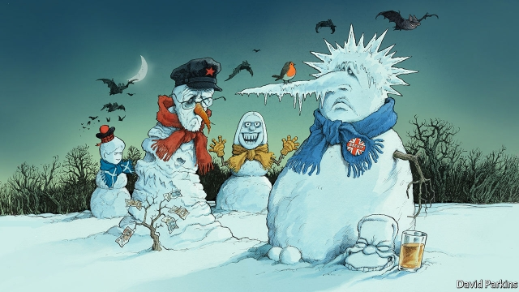

###### Our election endorsement

# Britain’s nightmare before Christmas 

 

> print-edition iconPrint edition | Leaders | Dec 5th 2019 

BRITISH VOTERS keep being called to the polls—and each time the options before them are worse. Labour and the Conservatives, once parties of the centre-left and -right, have steadily grown further apart in the three elections of the past four years. Next week voters face their starkest choice yet, between Boris Johnson, whose Tories promise a hard Brexit, and Jeremy Corbyn, whose Labour Party plans to “rewrite the rules of the economy” along radical socialist lines. Mr Johnson runs the most unpopular new government on record; Mr Corbyn is the most unpopular leader of the opposition. On Friday the 13th, unlucky Britons will wake to find one of these horrors in charge. 

At the last election, two years and a political era ago, we regretted the drift to the extremes. Today’s manifestos go a lot further. In 2017 Labour was on the left of the European mainstream. Today it would seize 10% of large firms’ equity, to be held in funds paying out mostly to the exchequer rather than to the workers who are meant to be the beneficiaries. It would phase in a four-day week, supposedly with no loss of pay. The list of industries to be nationalised seems only to grow. Drug patents could be forcibly licensed. The bill for a rapid increase in spending would fall on the rich and companies, whose tax burden would go from the lowest in the G7 to the highest. It is an attempt to deal with 21st-century problems using policies that failed in the 20th. 

Nor has Mr Corbyn done anything to dampen concerns about his broader worldview. A critic of Western foreign policy and sympathiser with dictators in Iran and Venezuela who oppose it, he blamed NATO for Russia’s invasion of Ukraine in 2014. Last year he suggested samples of a nerve agent used to poison a Russian former spy in Salisbury should be sent to Moscow, so Vladimir Putin could see if it was his. Under such a prime minister, Britain could not rely on receiving American intelligence. Nor has Mr Corbyn dealt with the anti-Semitism that has taken root in Labour on his watch. Some Remainers might swallow this as the price of a second Brexit referendum, which Mr Corbyn has at last promised. We have long argued for such a vote. Yet Mr Corbyn’s ruinous plans at home and bankrupt views abroad mean that this newspaper cannot support Labour. 

The Conservatives, too, have grown scarier since 2017. Mr Johnson has ditched the Brexit deal negotiated by Theresa May and struck a worse one, in effect lopping off Northern Ireland so that Britain can leave the European Union’s customs union. The public are so sick of the whole fiasco that his promise to “get Brexit done” wins votes. But he would do no such thing (see article). After Britain had left the EU early next year, the hard work of negotiating a trade agreement would begin. Mr Johnson says he would do this by the end of 2020 or leave without one. No-deal is thus still on the table—and a real prospect, since getting a deal in less than a year looks hard. The best estimates suggest that leaving without a deal would make average incomes 8% lower than they would otherwise have been after ten years. 

Brexit is not the only problem with Mr Johnson’s new-look Tories. He has purged moderates and accelerated the shift from an economically and socially liberal party into an economically interventionist and culturally conservative one. Angling for working-class, Leave-voting seats in the north, he has proposed extra state aid, buy-British government procurement and a sketchy tax-and-spending plan that does not add up. Also, he has absorbed the fatal lesson of the Brexit campaign: that there is no penalty for lying or breaking the rules. He promised not to suspend Parliament, then did; he promised not to extend the Brexit talks, then did. This chicanery corrodes trust in democracy. Like Mr Corbyn he has normalised prejudice, by displaying his own and failing to investigate it in his party (both men are thought racist by 30% of voters). For all these reasons this newspaper cannot support the Conservatives. 

That leaves a low bar for the Liberal Democrats, and they clear it. They, too, have become more extreme since we backed them in 2017. Under a new leader, Jo Swinson, they have gone beyond the idea of a second referendum for an irresponsible promise to reverse Brexit unilaterally. This has deservedly backfired. Yet their economic approach—a moderate increase in spending, paid for by broad-based tax increases—is the most sensible of the main parties, and is the only one to be honest about the cost of an ageing society. On climate change and social policy they strike the best balance between ambition and realism. As last time, they are the only choice for anyone who rejects both the hard Brexit of the Conservatives and the hard-left plans of Labour. 

Yet they will not win. So why back them? The practical reason is to restrain whoever ends up in Downing Street. Voters worry that backing the Lib Dems plays into Mr Corbyn’s hands, but our modelling suggests that votes and seats would come fairly evenly from both parties (see Graphic detail). Mr Corbyn is preparing to govern with the Scottish National Party, which would back most of his programme in return for another independence referendum. Having more Lib Dems would check his plans. Likewise, they would rein in Mr Johnson. Some Tories cling to the hope that if he wins a big majority he will drop the populist act and rediscover his liberal instincts. They are deluded. If he wins the Brexit-backing seats he is targeting with his promises of more state aid, do they expect him to switch back to the fantasy of building Singapore-on-Thames? The opposite is true: the bigger the Tory majority, the more drastic the party’s transformation. 

The principled reason is that the Lib Dems are closest to the liberalism on which this newspaper was founded. A strong Lib Dem showing would signal to voters who favour open markets and a liberal society that the centre is alive. The past few years have shown why Parliament needs good people such as Sam Gyimah, who left the Tories because of their extremism, and Chuka Umunna, who left Labour because of theirs. The course of Brexit has been repeatedly changed for the better by independent-minded MPs making the running. If Britain withdraws from the EU in January, the Lib Dem MPs will be among the best advocates of a deep trade deal and the strongest opponents of no-deal. There is no good outcome to this nightmare of an election. But for the centre to hold is the best hope for Britain. ■ 

