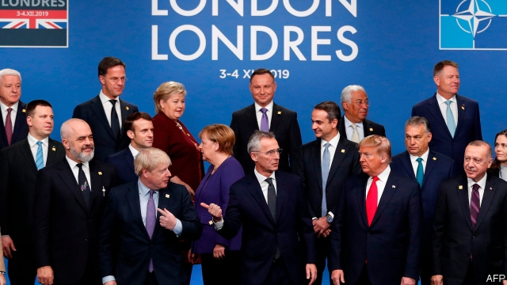

###### NATO’s summit

# New troublemakers emerge 

 

> print-edition iconPrint edition | Leaders | Dec 7th 2019 

SO MUCH TALK of “crisis” has surrounded NATO’s 70th-birthday year that it has been easy to forget there are reasons to celebrate. Not only has the alliance proved remarkably durable by historical standards, but since 2014 it has responded aptly to Russia’s aggression in Ukraine, refocusing on its core mission of collective defence. It has deployed multinational battlegroups into the three Baltic states and Poland and committed to improved readiness. Goaded by criticism from President Donald Trump, its members have raised their spending on defence. Though many countries, notably Germany, still fall short of their promises, NATO now estimates that between 2016 and 2020 its European members and Canada will shell out an extra $130bn. 

This new money helps explain one welcome development at the meeting of NATO leaders in Britain this week. Mr Trump, previously the disrupter-in-chief, who used to call the organisation “obsolete” and caused consternation at a summit in Brussels in 2018 by threatening to withdraw if Europeans failed to take on a fairer share of the burden, has—however briefly—become a defender. In London this week he blasted President Emmanuel Macron’s criticism of the alliance as “nasty” and “disrespectful”. He made no sign of blocking stern words on Russia or the reiteration of Article Five of NATO’s treaty, the cornerstone of the alliance. America’s commitment will be on display next year, when some 20,000 of its troops are to practise reinforcing Europe in an exercise called Defender 2020. 

The bad news is that other disrupters have emerged. The viscerally anti-NATO Jeremy Corbyn could conceivably become prime minister of one of its leading members after next week’s British general election. Turkey’s president, Recep Tayyip Erdogan, has caused consternation by buying a Russian anti-aircraft system, obstructing NATO’s decisions on eastern Europe and invading northern Syria without regard for his allies’ interests. He responded with personal insults to a suggestion by Mr Macron that, given Turkey’s actions in Syria, it might not be able to count on the mutual defence enshrined in Article Five. 

The most surprising troublemaker, and the reason relations have turned ugly, is Mr Macron himself. In a recent interview with The Economist he said that NATO was experiencing “brain-death”. He champions a stronger European defence, which Europe needs, and on December 4th insisted that this would “not be an alternative to NATO but one of its pillars”. But there is lingering suspicion of his intentions among other allies. That is partly because of his enthusiasm for a “strategic dialogue” with Russia. He has emphasised the threat of terrorism over the task of defending against Vladimir Putin’s aggression. Mr Macron is taking a long view and is seeking to stimulate fresh thinking, but most of his allies understandably hear his words as a threat to the progress of the past five years (see article). Russia’s actions, not just in Ukraine but also on NATO territory (including by sending assassins to Salisbury in Britain and, possibly, Berlin’s Tiergarten), call for a strong response. Any desire for concessions will be seen in Moscow as weakness. 

In Britain NATO papered over the cracks. The summit’s declaration affirmed its members’ commitment to Article Five and proclaimed that “Russia’s aggressive actions constitute a threat to Euro-Atlantic security”. That is welcome, but the alliance needs to find a new strategic coherence. Even if Mr Trump remains in favour, America’s focus is shifting ineluctably to its rivalry with China in Asia and beyond. Exercises and increasing readiness will cement the alliance at a military level—and this will endure while the politicians come and go. Work on newish areas such as space and cyberwarfare will help, too. Eventually, a strategic dialogue with Russia might make sense. But to thrive NATO also needs a greater common purpose. Once the impetus came from America. Mr Macron was right to point out that in future Europe will have to play a larger part. ■ 

