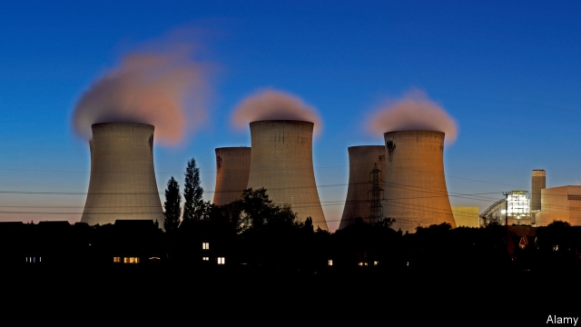
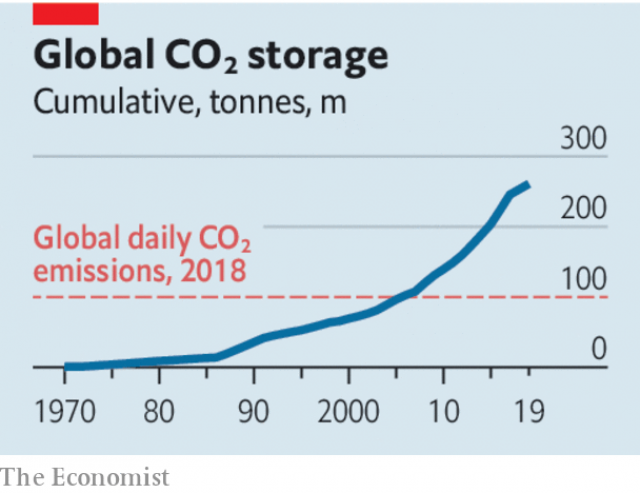

###### Climate change

# The necessity of pulling carbon dioxide out of the air 

 

> print-edition iconPrint edition | Leaders | Dec 7th 2019 

OF THE WISDOM taught in kindergartens, few commandments combine moral balance and practical propriety better than the instruction to clear up your own mess. As with messy toddlers, so with planet-spanning civilisations. The industrial nations which are adding alarming amounts of carbon dioxide to the atmosphere—43.1bn tonnes this year, according to a report released this week—will at some point need to go beyond today’s insufficient efforts to stop. They will need to put the world machine into reverse, and start taking carbon dioxide out. They are nowhere near ready to meet this challenge. 

Once such efforts might have been unnecessary. In 1992, at the Rio Earth summit, countries committed themselves to avoiding harmful climate change by reducing greenhouse-gas emissions, with rich countries helping poorer ones develop without exacerbating the problem. Yet almost every year since Rio has seen higher carbon-dioxide emissions than the year before. A staggering 50% of all the carbon dioxide humankind has put into the atmosphere since the Industrial Revolution was added after 1990. And it is this total stock of carbon that matters. The more there is in the atmosphere, the more the climate will shift—though climate lags behind the carbon-dioxide level, just as water in a pan takes time to warm up when you put it on a fire. 

The Paris agreement of 2015 commits its signatories to limiting the rise to 2°C. But as António Guterres, the UN secretary-general, told the nearly 200 countries that attended a meeting in Madrid to hammer out further details of the Paris agreement this week, “our efforts to reach these targets have been utterly inadequate.” 

 

The world is now 1°C (1.8°F) hotter than it was before the Industrial Revolution. Heatwaves once considered freakish are becoming commonplace. Arctic weather has gone haywire. Sea levels are rising as glaciers melt and ice-sheets thin. Coastlines are subjected to more violent storms and to higher storm surges. The chemistry of the oceans is changing. Barring radical attempts to reduce the amount of incoming sunshine through solar geoengineering, a very vexed subject, the world will not begin to cool off until carbon-dioxide levels start to fall. 

Considering that the world has yet to get a handle on cutting emissions, focusing on moving to negative emissions—the removal of carbon dioxide from the atmosphere—might seem premature. But it is already included in many national plans. Some countries, including Britain, have made commitments to move to “net zero” emissions by 2050; this does not mean stopping all emissions for all activities, such as flying and making cement, but taking out as much greenhouse gas as you let loose. 

The Intergovernmental Panel on Climate Change estimates that meeting the 1.5°C goal will mean capturing and storing hundreds of billions of tonnes of carbon dioxide by 2100, with a median estimate of 730bn tonnes—roughly 17 times this year’s carbon-dioxide emissions. In terms of designing, planning and building really large amounts of infrastructure, 2050 is not that far away. That is why methods of providing negative emissions need to be developed right now. 

That raises two problems, one technological, the other psychological. The technological one is that sucking tens of billions of tonnes of carbon dioxide out of the atmosphere every year is an enormous undertaking for which the world is not prepared. In principle it is simple to remove carbon dioxide by incorporating it in trees and plants or by capturing it from the flue gas of industrial plants and sequestering it underground. Ingenious new techniques may also be waiting to be discovered. But planting trees on a scale even remotely adequate to the task requires something close to a small continent. And developing the engineering systems to capture large amounts of carbon has been a hard slog, not so much because of scientific difficulties as the lack of incentives (see Briefing). 

The psychological problem is that, even while the capacity to ensure negative emissions languishes underdeveloped, the mere idea that they will one day be possible eats away at the perceived urgency of cutting emissions today. When the 2°C limit was first proposed in the 1990s, it was plausible to imagine that it might be met by emissions cuts alone. The fact that it can still be talked about today is almost entirely thanks to how the models with which climate prognosticators work have been revised to add in the gains from negative emissions. It is a trick that comes perilously close to magical thinking. 

This puts policymakers in a bind. It would be reckless not to try to develop the technology for negative emissions. But strict limits need to be kept on the tendency to demand more and more of that technology in future scenarios. As at kindergarten, some discipline is necessary. 

The first discipline is to keep in mind whose mess this is. One of the easiest routes to negative emissions is to grow plants. And the world’s cheap land tends to be in poor places. Some of these places would welcome investment in reforestation and afforestation, but they would also need to be able to integrate such endeavours into development plans which reflect their people’s needs. 

The second discipline is for those who talk blithely of “net zero”. When they do so, they should be bound to say what level of emissions they envisage, and thus how much negative emitting their pledge commits them to. The stricter they are about its use, the less they are in reality accommodating today’s polluters. 

The third discipline is that governments need to take steps to make negative emissions practicable at scale. In particular, research and incentives are needed to develop and deploy carbon-capture systems for industries, such as cement, that cannot help but produce carbon dioxide. A price on carbon is an essential step if such systems are to be efficient. The trouble is that a price high enough to make capture profitable at this stage in its development would be unfeasibly high. For the time being, therefore, other sticks and carrots will be needed. Governments tend to plead that radical action today is just too hard. And yet those very same governments enthusiastically turn to negative emissions as an easy way to make their climate pledges add up. ■ 

Sign up to our new fortnightly climate-change newsletter 

