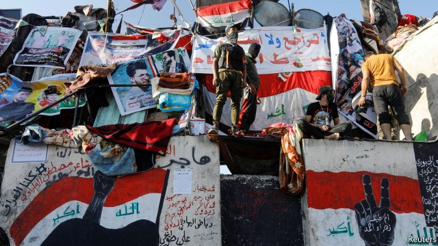

###### System failure

# Time for Iraq and Lebanon to ditch state-sponsored sectarianism 

 

> print-edition iconPrint edition | Leaders | Dec 7th 2019 

AS MANY ARAB leaders have fallen in the past year as did during the Arab spring. And still the wave of protests over corruption, unemployment and threadbare public services continues to sweep across the Middle East and north Africa. Turnover at the top has not mollified the masses, because rather than producing real change it has reshuffled entrenched elites. Particularly in Iraq and Lebanon, many of the protesters now want to tear down entire political systems. It is a dangerous moment. Yet the protesters are right to call for change. 

Both Iraq and Lebanon divvy up power among their religions and sects as a way of keeping the peace between them. Lebanon constructed a sectarian political system long before the civil war of 1975-90, and buttressed it afterwards. Iraq’s system was set up in 2003, after America’s invasion. It did not prevent Sunnis from fighting Shias. But the civil war is over in Iraq, as in Lebanon. It would seem risky to upset these fragile arrangements. 

Leaving them be would be even riskier. Start with Iraq, where America aimed to satisfy all groups but instead created a system that encourages patronage and empowers political parties (and militias) which entrench the country’s ethnic and sectarian divisions. It is difficult to get ahead in Iraqi politics—or indeed in life—without associating with one of these parties. They treat ministries like cash machines and hand out government jobs based on loyalty, not merit. Many people depend on them for access to health care, education or a salary. Hence politicians long ago exposed as corrupt and incompetent can remain in power. 

The situation is similar in Lebanon, where the warlords who razed the country became politicians who loot it. The government has racked up huge debts to fund Sunni, Shia and Christian patronage schemes. The World Bank estimates that the waste associated with the power-sharing system costs Lebanon 9% of GDP each year. The government cannot even keep the lights on. Or perhaps it does not want to, since the businessmen who sell generators are often connected to sectarian leaders. With a financial crisis looming, Lebanon must restructure its debt and introduce reforms. Its leaders seem incapable of doing so. 

Sectarian government is not only ineffective—it is also unrepresentative. Lebanon has not held a census since 1932, but The Economist obtained voter-registration lists from 2016. They show that the allotment of parliamentary seats to each religion does not match the share of voters from each faith. Polls show that Iraqis have lost trust in religious parties and leaders. Many people in both countries, especially the young, appear to be losing their personal faith, too (see article). 

The people of Iraq and Lebanon deserve political systems that do more to reflect their views and represent their interests. That means unpicking state-backed sectarianism. Increased transparency would help expose the worst patronage schemes; stronger institutions might curb them. Militias should be brought under the official chain of command. If Lebanon stopped forcing candidates to compete for seats that are allocated by religion, more might run on secular platforms, not sectarian ones. In Iraq the electoral law helps entrench big parties, while the electoral commission caters to elites. Both need reform. 

Such steps may not satisfy the protesters. And they will be resisted by vested interests and their foreign supporters. Hizbullah, a Shia militia-cum-political party in Lebanon, and the Shia militias of Iraq thrive under today’s system and fear being constrained. They are backed by Iran, which uses them to extend its influence. But Iran has also been rocked by big protests. The lesson for it is the same. Reform a political system that has failed the people, or risk seeing it come crashing down. ■ 

