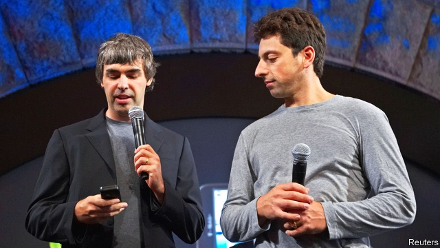

###### Departure of the founders

# Who will control Alphabet once Sergey Brin and Larry Page are gone? 

 

> print-edition iconPrint edition | Leaders | Dec 7th 2019 

“YEAH, OK, WHY not? I’ll just give it a try.” With those words Sergey Brin abandoned academia and poured his energy into Google, a new firm he had dreamed up with a friend, Larry Page. Incorporated in 1998, it developed PageRank, a way of cataloguing the burgeoning world wide web. Some 21 years on, Messrs Brin and Page are retiring from a giant that dominates the search business. Alphabet, as their firm is now known, is the world’s fourth-most-valuable listed company (see article), worth $910bn. In spite of its conspicuous success, they leave it facing three uncomfortable questions—about its strategy, its role in society and who is really in control. 

Silicon Valley has always featured entrepreneurs making giant leaps. Even by those standards Google jumped far, fast. From the start its search engine enjoyed a virtuous circle—the more people use it and the more data it collects, the more useful it becomes. The business model, in which advertisers pay to get the attention of users around the world, has printed money. It took Google just eight years to reach $10bn in annual sales. Its peak cumulative losses were $21m. By comparison, Uber has incinerated $15bn and still loses money. 

Today Alphabet is in rude health in many respects. Its search engine has billions of users, who find it one of the most useful tools in their lives. One recent study found that the typical user would need to be paid $17,530 to agree to forfeit access to a search engine for a year, compared with $322 for social-media sites, such as Facebook. Alphabet cranks out colossal profits. Many pretenders have tried to mimic the Google approach of having a vast customer base and exploring network effects. Only a few, including Facebook, have succeeded at such a scale. 

There are uncertainties, however. Take strategy first. Other tech giants have diversified away from their core business—Amazon began in e-commerce, for example, but is now big in cloud-computing. In China Tencent has shifted from video games to a huge array of services. Alphabet has not stood still: it bought YouTube in 2006 and shifted to mobile by launching Android, an operating system, in 2007. But it still makes 85% of its sales from search-advertising. A big bet on driverless cars has yet to pay off. As the firm matures, it should start paying a dividend. 

The second question is how closely the company might end up being regulated. Alphabet’s monopoly in the search business has led to worries that it may squeeze other firms unfairly. Its huge store of data raises privacy concerns. And because it is a conduit for information and news, its influence over politics has come under ever more scrutiny. All this augurs much tighter regulation. Alphabet has already paid or been subject to $9bn in fines in the EU, and in America politicians on both sides of the aisle support tighter rules or, in some cases, a break-up. If it were to be regulated like a utility, profits could fall sharply. 

The last question is who will be in control. Messrs Page and Brin famously sought “parental supervision” in 2001 and hired an external chief executive. Both founders will now relinquish any executive role, handing the reins to Sundar Pichai, a company stalwart. Yet dual-class shares mean they will still control over 50% of the firm’s voting rights. This structure is popular in Silicon Valley. But there is little evidence that it ages well. Of today’s digital giants, two have so far faced succession—Microsoft and Apple. They have prospered partly because their founders or their families did not retain voting control after they left the scene. Alphabet’s founders should forfeit their special voting rights and gradually sell their shares. Their firm faces deep questions—best to give someone else the freedom to answer them.■ 

