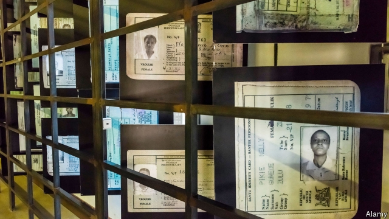
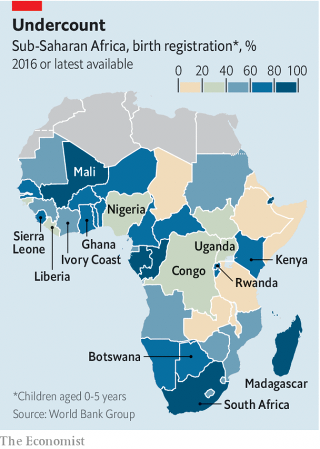

###### Papers, please

# African countries are struggling to build robust identity systems 

 

> print-edition iconPrint edition | Middle East and Africa | Dec 7th 2019 

THE FIRST thing that visitors to the Apartheid Museum in Johannesburg see is a wall of identity cards—the pieces of paper that determined where people could live and work and whom they could love. From the outset, the apartheid regime’s ability to discriminate against “nie-blankes” (non-whites) depended on having a robust system of identifying people. 

The opposite problem confronts most other countries in Africa today. Governments have little idea who their citizens are. Around the world, about one billion people lack official proof of their identities, reckons the World Bank. Such citizens cannot, in many cases, get services such as health care, welfare and education. They also struggle to exercise their rights to vote or live in their home countries. States need this information, too. Without it, governments have no idea whom to tax, conscript and protect, or where to allocate resources. 

This is not just a poor-world problem. Britain was recently rocked by the “Windrush” debacle, in which dozens of citizens were wrongly deported. But it is a particularly acute problem in sub-Saharan Africa, where one in two people cannot prove his or her identity. It is not for want of effort. Every country in the region has either established or plans to create a universal identity programme. 

 

Some countries, such as South Africa and Botswana, have relatively good programmes that register most births and issue papers to almost all of their people. At the other end of the spectrum are countries like Congo and Liberia, which are only just getting started in registering births, never mind issuing identity documents (see map). In the middle are countries that are upgrading from old, paper-based systems to digital ones. 

This is more complicated than it sounds. Take Nigeria, which has 13 federal and three state ID schemes. The country’s National Identity Management Commission (NIMC), a body set up in 2007 with the purpose of issuing identity numbers and cards to Nigeria’s 180m people, has so far reached less than a fifth of the population. 

African countries struggle for several reasons. One is racial discrimination. Uganda, Liberia and Sierra Leone explicitly withhold nationality from children of certain races and ethnicities. Other countries do so informally by refusing to issue papers. Another reason is a failure by governments to explain to their citizens how they might benefit. Consider birth registration, the most basic form of official identity. South Asia more than doubled its rate of birth registration to 71% between 2000 and 2014. In sub-Saharan Africa the rate dropped by one point, to 41%, over the same period. For poor villagers, going to a government office to register a birth is time-consuming and expensive, especially when officials demand bribes. Some countries charge a fee, which is a disincentive. Others penalise late registrations. 

One way to encourage people is to link birth registration to benefits such as child-support grants—something South Africa did with great success. But that approach may also have the perverse consequence of denying payments to the very poorest. 

Money is another reason many African countries have fallen behind their peers. Extending the state’s reach to remote areas can be expensive. So, too, is paying for skilled labour of the sort required to fill in forms accurately and to operate biometric machines. The technology itself is costly, especially for small countries that do not have much buying power. 

Many governments have unwisely bought proprietary systems, meaning that they are forced to go back to the seller for maintenance, upgrades and new components. That can be expensive. When Nigeria’s NIMC wanted to use its own card-printing machines, the firm that had sold it software tried to insist that Nigeria buy its machines as well, says Tunji Durodola, an adviser to the commission. (They eventually got help from Pakistan, which had software that worked on any machine.) 

But there are signs of change coming from within the industry itself, spurred by developments in an entirely different part of the world: India. Like Africa, it is vast, poor and home to more than a billion people. Yet as a single country India has tremendous negotiating power. 

When India developed its “Aadhaar” identity programme it invited leading firms to bid—but with the caveat that they provide open-source software, or code that can be examined and changed by others. This allowed engineers to knit together different bits of a system such as databases, enrolment software, fingerprint scanners and so on. The suppliers agreed because they did not want to miss out on the biggest identity bonanza the world had ever seen. Moreover, India’s spending led to a big increase in production, which caused prices to fall across the industry. 

The ripples of India’s big splash are now lapping on Africa’s shores. Companies including Idemia, Gemalto and De La Rue have agreed to establish “open standards”. This is one step short of open-source standards, but it is enough to allow different bits of a system to talk to each other. That would allow countries to buy the parts they need from competing companies, giving them greater flexibility at lower costs. 

Eleven countries, including Uganda, Congo, Ivory Coast, Ghana, Mali and Madagascar, have signed up to an industry advisory committee to develop these open standards. “The industry has been almost like a craft industry and now it’s moving towards a commodity industry and standardisation,” says Alan Gelb of the Centre for Global Development, a think-tank. 

Even as governments think about the technical problems of recording identity, they also need to grapple with the far more consequential ones around rights, governance and privacy. The starkest warning of the misuse of identity was in the Rwandan genocide, where ID papers listed ethnicity, making it easy to target Tutsis. Since data on religion and ethnicity are not needed to provide services, governments should not be hoovering it up, yet many still do. 

States should also be wary of denying people their rights by creating a class of citizens without papers. In Kenya, for example, the government wants everyone to register for ID cards, but it discriminates against members of the Nubian minority by forcing them to appear before a security panel to prove their nationality. Modern identity systems promise to bring many benefits to Africa. But as they proliferate, so too will the temptation for politicians to misuse them. ■ 

