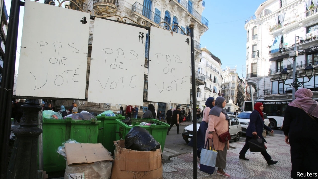

###### Once more, without enthusiasm

# Algerians fear their election will be a blow to democracy 

 

> print-edition iconPrint edition | Middle East and Africa | Dec 7th 2019 

THE MOST popular candidate in Algeria’s presidential election might be a rubbish bag. On December 12th Algerians will choose a successor to Abdelaziz Bouteflika, who stepped down in April after 20 years of dictatorial rule. Or, rather, a small minority of Algeria’s 41m people will choose one. Much of the country seems unenthused by the vote. In the capital, Algiers, protesters hang rubbish bags over campaign posters or replace them with pictures of jailed activists. One candidate’s headquarters was pelted with eggs and tomatoes. Another was forced to cancel his first campaign rally because almost no one turned up. 

To hear the government tell it, the election is an important step towards democracy. It will probably be the most tightly contested presidential vote since 1995. Yet for the millions of Algerians who demanded the ousting of Mr Bouteflika—and who continue to protest—it is nothing to celebrate. Instead the election demonstrates the difficulty of removing the structures that sustained the strongman. 

First scheduled for July, the election was postponed amid calls for a boycott. Only two people, a veterinarian and a mechanic, registered to run. This time 23 candidates tried to make the ballot. Most failed to meet the requirements, such as collecting signatures from supporters in at least 25 provinces. The five who made it all served under Mr Bouteflika—two as prime minister, two as cabinet members and the fifth as an MP who led a small loyalist party. 

It may seem paradoxical to shun an election to support democracy. But activists say they have learned from the failed uprisings in countries like Egypt, where protesters toppled a ruler but not his regime. By the end of his long reign, the ailing Mr Bouteflika was no longer up to the task of running the country. Though he remained the figurehead, a group of men known as le pouvoir wielded power behind the scenes. They are loth to surrender it. 

For the armed forces, which saw their own pouvoir curtailed in favour of businessmen close to Mr Bouteflika, the current vacuum is a chance to regain control. One of the candidates, Abdelmadjid Tebboune, a former prime minister, is thought to be close to the army chief, Gaid Salah. 

The regime had hoped to simply outlast the protesters, who call themselves Hirak (“movement” in Arabic). That strategy has not yet worked: Algerians have demonstrated every week since February. As the election approaches the regime has turned to coercion, detaining scores of activists and journalists. Having been embarrassed in July, the authorities are determined to hold the vote. General Salah warns of foreign plots against Algeria, while the interior minister labels critics of the election as “traitors, mercenaries, homosexuals”. 

The bigger question is what happens after December 12th. Algeria will have a new president widely seen as illegitimate. But he will still be president, with all the power that entails. Compared with other Arab countries, the repression in Algeria has been mild. The incoming president, keen to cement his grip on power, may not show such forbearance. 

He will also inherit a stagnant economy. Despite its vast oil and gas wealth, Algeria’s per-capita income is below that of some resource-poor Arab states, such as Lebanon. Unemployment is 12% overall and much higher for young people. The finance minister recently warned that foreign reserves, which amounted to $200bn in 2014, may drop to $50bn by the end of next year. The value of oil and gas exports, which supply 60% of government revenue, fell by 13% in the first nine months of 2019. A new hydrocarbons law, meant to draw foreign investment, has been criticised by protesters and energy experts alike. 

Algerians are not alone. In Sudan, Lebanon and Iraq this year angry citizens toppled their rulers but have struggled to force deeper changes. The protests cannot continue for ever. Algeria’s election might be a stunt to keep the ancien régime in power—but that does not mean it will fail. ■ 

