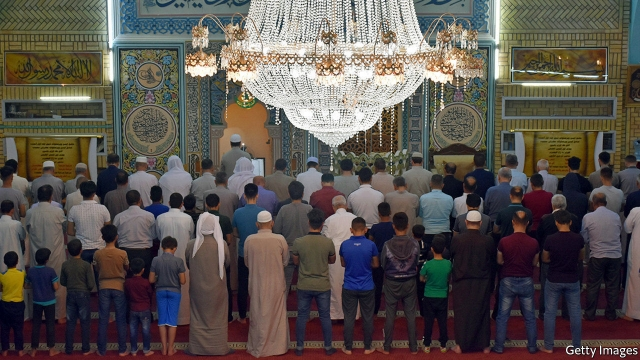
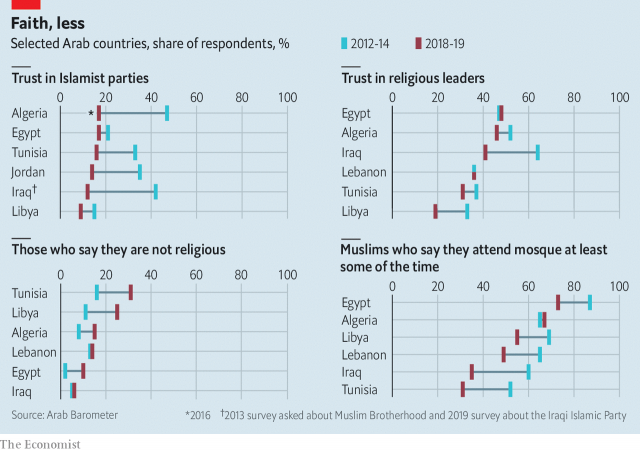

###### The numbers behind the rage

# Arabs are losing faith in religious parties and leaders 

 

> print-edition iconPrint edition | Middle East and Africa | Dec 7th 2019 

“NO TO RELIGION or sect,” cry the protesters in Iraq. “No to Islam, no to Christianity, revolt for the nation,” echo those in Lebanon. Across the Arab world people are turning against religious political parties and the clerics who helped bring them to power. Many appear to be giving up on Islam, too. 

These trends are reflected in new data from Arab Barometer, a pollster that surveys Arab countries. Across the region the share of people expressing much trust in political parties, most of which have a religious tint, has fallen by well over a third since 2011, to 15%. (The share of Iraqis who say they do not trust parties at all rose from 51% to 78%.) The decline in trust for Islamist parties is similarly dramatic, falling from 35% in 2013, when the question was first widely asked, to 20% in 2018. 

 

The doubts extend to religious leaders. In 2013 around 51% of respondents said they trusted their religious leaders to a “great” or “medium” extent. When a comparable question was asked last year the number was down to 40%. The share of Arabs who think religious leaders should have influence over government decision-making is also steadily declining. “State religious actors are often perceived as co-opted by the regime, making citizens unlikely to trust them,” says Michael Robbins of Arab Barometer. 

The share of Arabs describing themselves as “not religious” is up to 13%, from 8% in 2013. That includes nearly half of young Tunisians, a third of young Libyans, a quarter of young Algerians and a fifth of young Egyptians. But the numbers are fuzzy. Nearly half of Iraqis described themselves as “religious”, up from 39% in 2013. Yet the share who say they attend Friday prayers has fallen by nearly half, to 33%. Perhaps faith is increasingly personal, says Mr Robbins. 

