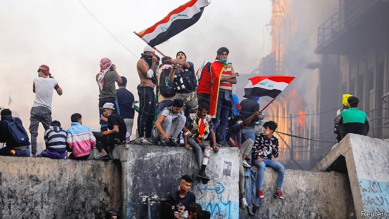

###### The fight for Iraq’s future

# Elites backed by Iran are clinging to power in Iraq 

 

> print-edition iconPrint edition | Middle East and Africa | Dec 7th 2019 

THE TOMB of a dead Shia cleric might seem an odd target for Iraqi protesters angry about corruption, poor governance and a lack of jobs. Muhammad Baqr al-Hakim resisted Saddam Hussein, Iraq’s old dictator, and helped to create the modern state. But he also had close ties to Iran, which has assisted the Iraqi government in trying to subdue the protesters. Such meddling enrages Iraqis, who threw petrol bombs at Hakim’s shrine—and the Iranian-backed militiamen guarding it—earlier this month in Najaf. They also torched the nearby Iranian consulate. 

Iraq has been rocked by protests since October. Hundreds of thousands of people have taken to the streets in Baghdad and the Shia south. Officials have promised reforms. The security forces have fired on the demonstrators, killing more than 400. Neither concessions nor repression have worked. Things came to a head on November 29th, when the senior Shia cleric, Grand Ayatollah Ali al-Sistani, called for a change of government. In response, Adel Abdul-Mahdi, Iraq’s prime minister, said he would step down. 

But the protesters and the ruling elite know that Mr Abdul-Mahdi’s departure is not the endgame. Rather, it is likely to mark the start of a new, potentially more violent struggle over what comes next for the government. It will probably lead to even greater involvement by Iran. 

For now Mr Abdul-Mahdi remains in his job. The Shia warlords-cum-politicians who are Iraq’s real power-brokers will choose his successor, with input from Iran. Many of them want the next prime minister to be more ruthless. Hadi al-Amari and Qais Khazali claim to head the largest bloc in parliament and control powerful militias. They work with Qassem Suleimani, the commander of the Quds Force, the foreign legion of Iran’s Islamic Revolutionary Guard Corps. All want to spread Shia influence across the region, and view the protests as a threat. Some of their allies favour clearing the streets by force. 

Sunni and Kurdish parties, like their Shia counterparts, plunder the state and are thus loth to speak up for the protesters and upset the status quo. The constitution suggests that President Barham Salih, a Sunni Kurd, should have assumed the prime minister’s responsibilities following Mr Abdul-Mahdi’s resignation. But he has said little since calling for the prosecution of those who killed protesters, and is facing threats himself. Muqtada al-Sadr, a rabble-rousing Shia cleric who heads a large bloc in parliament, also seems muzzled. He has spent long stints in Iran—under a form of house arrest, say some. 

Iraq’s other institutions have fallen into line. Judges sentence protesters under anti-terror laws. The communications ministry shuts down the internet to make it harder for them to organise. The security forces have so far limited their use of violence—but only, it seems, to avoid a more forceful response from the West (or the clerics). That does not appear to be coming. A resolution condemning the government’s brutality would be unlikely to pass in the UN Security Council. America has told the Iraqi government to listen to the protesters and make reforms. But it too is reluctant to get more involved. 

The protesters are calling for an entirely new government, a fairer electoral law and early elections. They want to put politicians on trial for corruption and the recent violence. They want Iran and the militias it backs to go away, too. Most of the public is behind them. But they need the support of influential people like Mr Sistani, who is 89. “It is for the people”, not the clerics, “to decide what they perceive is most fitting,” read his sermon on November 29th. That was seen as a boost to the protesters, a shot at Iran and its clerical rule, and perhaps a signal that he wishes to withdraw from the political fray. Some of Iraq’s clerics fear provoking Iran, or losing credibility if the government ignores their advice. 

In spite of the killings, the protesters’ morale remains high. The demonstrations have a carnival atmosphere in some cities. But in others, such as Hilla, officials have been chased out. The subtle messages in Mr Sistani’s sermons do not satisfy everyone. The ranks of the protesters are dominated by young jobless men, some of whom prefer throwing petrol bombs to peaceful marching. “They run towards bullets,” says an observer. Lately, armed tribesmen have pursued vendettas against the security forces. Things could get much worse. ■ 

