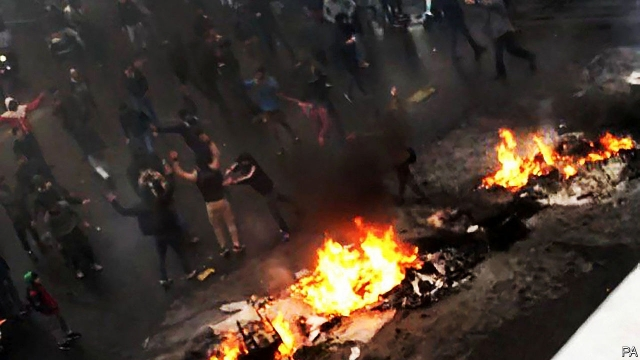

###### Unprecedented violence

# How the Iranian regime put down economic protests 

 

> print-edition iconPrint edition | Middle East and Africa | Dec 7th 2019 

ALMOST IMMEDIATELY after the government of Iran switched the internet back on, the stories started coming out. Near the city of Mahshahr alone, the Islamic Revolutionary Guards Corps surrounded, shot and killed 40 to 100 protesters in a marsh, witnesses told the New York Times. Altogether, between 180 and 450 people are thought to have been killed by the government during protests over a rise in the state-controlled price of fuel last month. About 7,000 people were detained out of the hundreds of thousands who took to the streets in all but two of Iran’s 31 provinces. Not since the Islamic revolution in 1979 has the country experienced such deadly unrest. 

The regime responded to previous protests with more patience, letting people vent for a few days before rounding up the ringleaders. “This time they shot to kill, not to intimidate,” says an academic from Shahriar, a town where the protests flared. Such was the perceived threat that the regime’s hardliners and pragmatists put aside their rivalries and worked together, unleashing their respective security forces. 

Their panic owes much to the make-up of the protesters. Many came from the urban poor, whom the regime calls mostazafin (downtrodden) and considers its base. In 1979 they poured onto the streets to bring down the shah; now their grandchildren are turning on the clerics. Some middle-class folk joined them on the streets for the first time since 2009, when they protested a suspicious election outcome. 

Economic hardship, exacerbated by American sanctions, is a big cause of the anger. But many are also fed up with official corruption. The public is turning social-justice arguments back on the clerics, who are accused of milking the state. “The ideological challenge is much more dangerous than the economic challenge,” says Pejman Abdolmohammadi of the University of Trento in Italy. 

Official repression will deter many from challenging the regime, but those who do may become more violent. Some of the recent protests turned into riots. Instructions on how to make petrol bombs circulate on social media. In some areas people have begun taking up arms. The uprising in neighbouring Iraq provides inspiration. “For Iraqis and Iranians it’s one enemy,” says an exiled Iranian dissident. “They’re fighting the same regime.” ■ 

