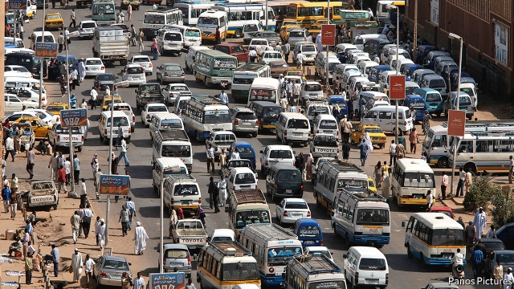

###### Change hits a speed bump

# Jammed streets highlight the challenges of Sudan’s transition 

 

> print-edition iconPrint edition | Middle East and Africa | Dec 7th 2019 

SOUAD AL-SAWY squints in the glare of the mid-afternoon sun, searching for a bus home. The 18-year-old student’s commute used to take 20 minutes, but these days it can take up to 90. “It’s getting worse every day,” she sighs. Although life after the revolution has improved in many ways—for instance, a hated law that banned women from wearing revealing clothing was repealed last month—freedom was not supposed to involve so many traffic jams. 

Seven months after the fall of Omar al-Bashir and his 30-year-long kleptocracy, Sudan is struggling to escape the legacy of corruption and mismanagement he bequeathed it. Nowhere is this more evident than in the traffic-clogged streets of Khartoum, the capital, where public transport has all but disappeared. So bad is the shortage of buses that the interim government has decreed that vehicles belonging to the police and army be used to ferry ordinary people about the city. 

Traffic jams are the work of the “deep state”, conjectures Ms Sawy. A group of minibus owners in north Khartoum claim that saboteurs are causing gridlock by abandoning vehicles in the roadways. Some blame members of the former ruling party, the National Congress Party (NCP), which owned nearly 40,000 vehicles. 

As for the vanishing public transport, Yasir Alkordi, a journalist, reported in September that bus drivers had been paid by NCP members to shirk work. The aim of these “dirty tricks” is to undermine the new government, says Mohammed Ali Fazan, another journalist. “By hook or by crook, [the NCP] wants to come back to power again.” On November 28th the government passed a law to dissolve the party and seize its assets. But government institutions, including the Khartoum State Transportation Company, are still stuffed with former loyalists, who cannot all be removed at once. 

The real causes of the transport crisis are, however, probably mundane economics rather than a conspiracy. The state-regulated fares are too low to pay for the maintenance of buses shaken to bits on Khartoum’s shoddy roads. Mohammed Ali, a driver, says that a year or so ago there were 130 minibuses working his route; now there are only seven. The government plans to extend roads and import buses, and has started running trains that, thanks to corruption, had been idle for years. But cleaning up the mess will take time and money. It might be short of both. ■ 

