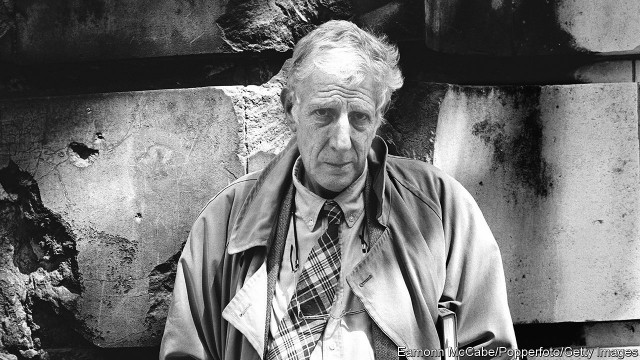

###### Intention and accident

# Obituary: Jonathan Miller died on November 27th 

 

> print-edition iconPrint edition | Obituary | Dec 7th 2019 

WHENEVER HE ERUPTED onto a set or into a studio, Jonathan Miller made an instant impression. Part came from his height and gawkiness, the tweed jacket, the excessively angular elbows and knees (since the body was not only possesssed by him but also possessed him, making up a large part of what he actually was, including his notions of effort and success). But he also drew attention because, as often as not, he had a book of neuroscience in his hand. 

The point he was making was this. Science was hard, and needed constant application. But the sort of thing he spent five decades doing, putting on plays, making television documentaries, directing more than 50 operas, he could achieve with his left hand behind his back. Art was easy, ridiculously so. Most television was utter banality; most opera forgettable, vulgar and sentimental. So it took very little originality to make them memorable. He liked to invoke the psychologists’ duck-rabbit sketch, in which the seeing of the duck precluded the alternative seeing of the rabbit, and vice versa; to bring to the fore “aspects” of a work, as Wittgenstein said, that had previously been invisible, so that audiences would perceive it in a completely different way. 

For the BBC in 1966, for example, he turned “Alice in Wonderland”, which had been horribly Disneyfied, into a Victorian child’s dream of a hot Oxford summer in which all the characters were prating or dozing dons. That was what the story was about: Oxford, childhood. (People who said it was Freudian clearly knew nothing about Freud.) In 1982 he set Verdi’s “Rigoletto” in Little Italy in New York, with mobsters swaggering and “La Donna è Mobile” kicked out of a jukebox, because Verdi’s duke was clearly a hoodlum too, and the atmosphere that of “The Godfather”. His “Così fan Tutte” in 1995 had costumes by Armani, huge mirrors and mobile phones, a comment on the narcissism of the modern age. His “St Matthew Passion” took the performers out of their tuxedos and inert choirs and put them in a circle, in their own clothes, acting out the drama; his film of “The Symposium”, called “The Drinking Party”, put the actors into dinner jackets as old boys at a school reunion, reading Plato’s discourse on love in one of the temples at Stowe. 

All those were great successes, cementing his reputation as the most brilliant mind on the British cultural scene, and yet even then he agonised over why he was doing this. He had meant to be a doctor, specifically a neurologist. Instead, probably out of weak-mindedness, he always said “yes” whenever anyone turned up at his door and asked if he would like to play. (It was almost involuntary, like blushing or sneezing, and he could never identify the point at which the conscious exercise of intention occurred.) The first of these accidents happened when he was lured away from his medical training by three Cambridge friends, Alan Bennett, Peter Cook and Dudley Moore, to write and perform in “Beyond the Fringe” in 1960, a revue which pilloried everything the English held dear, from the Battle of Britain to tea to Shakespeare. After this had electrified both London and New York, it was hard to go back to hospital work. But he would have done, had he not been invited to direct a play at the Royal Court…then to direct opera for Sadler’s Wells…then to the National Theatre…and so it went. He fell into work as he fell into long-lasting love, accidentally. 

Yet he should have stayed intentionally with medicine. First, because what he was doing was ephemeral, even when his “Rigoletto” and his “Mikado”(translated to the Marx Brothers’ Fredonia, and with the Japanese stripped out) were both in the repertoire for decades. By contrast, originality in medicine could bring lasting benefit. And second, because in science one was either right or wrong, and one’s work was peer-reviewed by people who at least knew the topic. Instead he had to put up with critics, snivelling pipsqueaks who knew 100% less than he did about the piece in question but whined that he was messing it around. When they called him a polymath, a term he loathed, they really meant he was a jack of all trades and master of none. What idiot invertebrates they all were, like the sea slugs he had collected as a boy and then had the greatest pleasure dissecting and slicing for his microscope. God (though it had never occurred to him that there might be a God) could rot the lot of them. 

As some consolation, he could bring his medical expertise to bear on art. For the BBC he produced a television series, “The Body in Question”, in which among a firework display of observations he compared red blood cells clotting to Duchamp’s “Nude descending a staircase” and the movement of cilia on cells to Van Gogh’s “Wheatfield with Lark”. His radio series on madness featured the voices of both experts and those being treated. In opera, too, he applied the knowledge gained from listening to, and watching, patients. In “La Traviata” he asked Violetta to twist her hair as she sang, another almost involuntary gesture, and strictly made her stay in bed for her death aria. It was a full-time business, dying. 

England he found difficult, with its snobberies and condescensions. His knighthood (though of course he said yes to it, weakly, as ever) made him shrivel up. He could have lived in New York, where he briefly worked for the New Yorker and where, for the first time, he felt Jewish. But he stayed put, moving all of a mile from Park Crescent NW1, where he was born, to Gloucester Crescent NW1, with Alan Bennett over the road. He lived among countless books, the notebooks in which he recorded his curiosity about everything, and his photographs of bits of buildings and superimposed layers of posters on walls, the discrete instalments from which his perception of the world incrementally emerged. 

Did all this add up to a triumphant life? Many would have thought so. In moments of relaxation and satisfaction he would rock his long frame back and clasp his hands behind his head. But Wittgenstein’s nagging question remained: exactly what made the difference between “I lift my arms,” and “My arms go up”?■ 

