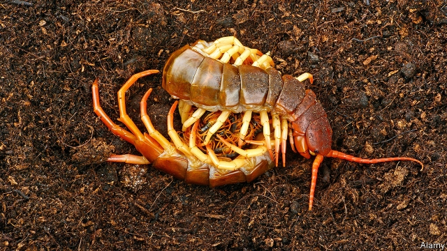

###### Animal behaviour

# Even aggressive centipedes will co-operate if they have to 

 

> print-edition iconPrint edition | Science and technology | Dec 7th 2019 

CENTIPEDES DO NOT generally get on well together. Even members of the same species may attack one another when they meet. So it is a surprise to find mother centipedes sharing nests and a double surprise to find that those co-residents are sometimes not even conspecifics. This, though, is the conclusion of research published in Biotropica by Farnon Ellwood and Josie Phillips of the University of the West of England, in Bristol. 

Dr Ellwood studies the invertebrates of the Danum Valley, an area of rainforest in Sabah, a Malaysian state in north Borneo. His past expeditions have found lots of centipedes living in epiphytes called bird’s nest ferns. These ferns tolerate the low illumination beneath a forest’s light-absorbing canopy and may weigh more than 200kg. They and their inhabitants are hard to investigate because they grow on tree trunks dozens of metres above the ground. But when Dr Ellwood did bring a few down to terra firma he found that the largest of them contained, besides the plethora of herbivorous insects he was expecting, 126 centipedes. That led him to wonder whether, rather than migrating from the ground as he had previously assumed was the origin of such myriapods in tree tops, the creatures were actually being born there. 

To investigate the matter he and Ms Phillips collaborated with colleagues from Sabah’s Forestry Department and the Natural History Museum, in London, to set up climbing lines in local trees and use them to collect bird’s nest ferns. Each specimen was, as it broke loose from the tree, decanted straight into a clear plastic bag to stop its centipede inhabitants escaping. It was then lowered to the ground using pulleys. In total, the researchers nabbed 44 ferns in this way—half from the highest part of the canopy, above 40 metres, and the rest from above 20 metres. Once a fern was safely landed they dissected it and dropped every centipede found into a solution of ethanol, to kill and preserve it. Also, before themselves descending the trees, the collectors put data loggers into some of the ferns they had left in place, to measure the temperature within and outside the plants. 

It quickly became apparent, when the researchers began pulling the ferns apart, that some of them contained centipede nurseries. Deep inside they discovered special chambers that the creatures had made by chewing through the fern’s inner roots. Here, mother centipedes were curled protectively around clutches of eggs or juveniles. The team found ten such nests. And three of them were shared by females of different species. 

Maternal behaviour by tropical centipedes is not unknown. In particular, females will hang around to keep eggs and newly hatched larvae clean, to stop fungal infestations developing on them. They also bring prey for the youngsters to feed on. Tolerating nest mates, though, is a different matter. Dr Ellwood and Ms Phillips reckon that this curious behaviour is driven by matters climatic. 

The climate in question is not, however, that of the rainforest as a whole. Rather, it is the microclimate inside a fern itself. The data loggers left behind by the fern collectors showed that during the hottest part of the day the temperature inside a fern is as much as 6°C lower than that outside. Dr Ellwood suspects this heat-shielding makes ferns attractive places for centipedes to raise their heat-sensitive young—and that the limited space available inside a fern has caused natural selection to put mother centipedes’ aggressive instincts on hold and make them considerably more tolerant of one another’s company when nesting than might otherwise be the case.■ 

