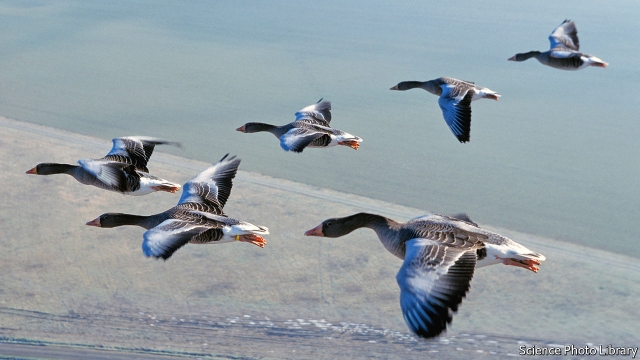

###### Aviation

# If aircraft can copy the way geese fly, they will save fuel 

 

> print-edition iconPrint edition | Science and technology | Dec 7th 2019 

IN THE CUT-THROAT business of civil aviation, every little helps. So researchers at Airbus, Europe’s biggest aircraft manufacturer, have been experimenting with a wheeze which they hope might shave up to 10% off an airliner’s fuel consumption. This is to hitch a ride on the wake of the plane in front. 

It is a familiar idea. Evolution blundered across it millions of years ago, and it explains why skeins of geese, swans and so on adopt a V-shaped formation when flying in groups. Vortices of air shed from the tips of a bird’s wings represent wasted effort. But that effort can be captured as lift by another bird trailing at the correct distance and angle. 

Aeronautical engineers have long dreamed of flying platoons of planes in a similar way, with trailing aircraft surfing the wakes of those leading the convoy. The problem is catching the supportive updraft at one side of a vortex rather than the turbulence-inducing downdraft on the other side—and doing so far enough from the vortex’s powerful core to ride it safely and without spilling the passengers’ drinks. 

Airbus’s researchers, under the aegis of Sandra Bour Schaeffer, head of Airbus Group Demonstrators, have been trying to work out the details by flying a series of tests in which an A350-900 follows in the wake of an A380, both having been loaded with ballast to simulate the weight of passengers and cargo. To do this, the test pilots needed a way to see the vortices’ cores, in order to avoid steering into them—which would risk crashing the plane. Early experiments used smoke to make vortices visible. This approach was then replaced with lidars (the optical equivalent of radars). Using these, Airbus’s researchers were able to measure the shape of a vortex at different distances behind the leading aircraft. 

The trailing pilots then proceeded, in careful stages, to approach closer and closer to the outer portion of the wake, while engineers in the back of the plane crunched data such as fuel consumption and the speed and accelerations of the two aircraft. Early in the tests, in 2016, over southern France, the team observed that by positioning the trailing aircraft at a particular distance—a “sweet spot”—the ride would be especially smooth, with the fuel-burn reduced by more than 10%. 

This sweet spot, they found, is between one and a half and three kilometres behind the leader, and slightly to its side. Since the vortex shape and position change with altitude and temperature, as well as the velocity and weight of the leading aeroplane, so does the location of the sweet spot. 

Working out how to incorporate all this into an aircraft’s autopilot will take a while. Ms Bour Schaeffer hopes to run further tests next year and then, in 2021, to extend these to involve a pair of commercial airlines. The biggest obstacle, if those tests prove satisfactory, will be gaining the approval of air-traffic controllers and regulators. At a typical cruising speed a distance of two or three kilometres takes only a few seconds for a plane to cover, and the idea of flying that close for long distances has raised eyebrows among both pilots and engineers. Flight-control and precision-navigation technology are, though, getting better and better. And regulators may also wish to take into account the disfavour the air-travel industry is experiencing as a result of the carbon dioxide it is adding to the atmosphere. Saving fuel not only saves money, it also saves CO2.■ 

