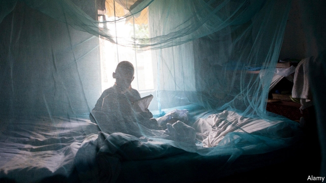
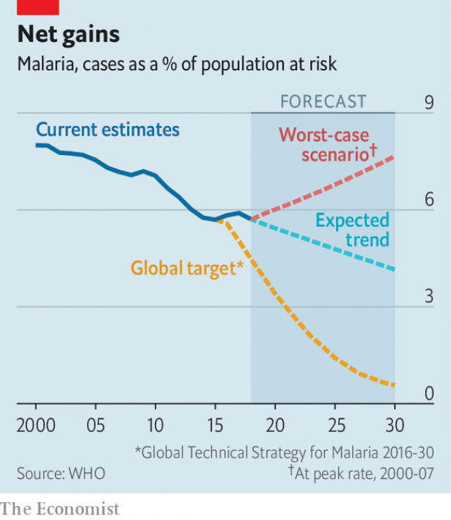

###### Tropical disease

# Malaria infections have stopped falling 

 

> print-edition iconPrint edition | Science and technology | Dec 7th 2019 

AFEW YEARS ago it looked as if malaria might be on the way out. From 2000 to 2014 the number of cases and deaths fell. As the World Health Organisation’s annual report on the disease shows, though, the decline in cases has ended (see chart) and that in deaths has slowed. The report, published on December 4th, says there were 228m cases of malaria in 2018, which resulted in 400,000 deaths. Most victims were young children in Africa. That is a far cry from targets set in 2015 for the near-elimination of malaria by 2030. 

 

That strategy of elimination had counted on $6bn a year being poured into malaria-control efforts. Funding in recent years, however, has been about $3bn a year. More money would surely help. But substantial gains can be made by doing things more efficiently—something at which malaria programmes have been dismal. 

Stopping malaria relies on three things: insecticide-treated bed nets to prevent nocturnal mosquito bites; the spraying of homes with insecticides; and the treating of pregnant women and children with rounds of preventive medication. These are all “imperfect tools, often used imperfectly”, says Pedro Alonso, head of the malaria programme at the World Health Organisation. Countries usually deploy the same package of measures everywhere, even though infection rates and their seasonal patterns vary a lot between regions, and particularly between cities and the countryside. Transmission reaches a peak in the rainy season, when mosquitoes are abundant, so preventive mass-treatment of children then can make a huge difference. Regional variations are particularly pronounced in large countries like Nigeria—a place that, by itself, accounts for a quarter of the world’s malaria cases. 

The typical approach of a malaria-control programme is to bombard a country with bed nets and then use whatever cash remains for sporadic rounds of preventive medication. But in many big cities, such as Dar es Salaam and Nairobi, cases are few and far between, so deploying nets there is a waste. Overspending on nets at the expense of other things happens partly because nets are easy to count—a feature that aid programmes are particularly fond of. Results which cannot be attributed directly to money a donor spends tend to fall further down that donor’s list of priorities. This kind of reasoning tips the scales, because foreign aid accounts for two-thirds of the money spent on malaria. 

Another problem is patchy data about local disease patterns. This makes it tricky to work out the best mix of malaria-control measures for a given area—and when to deploy them. Still, it is better to use whatever figures are available, because that will initiate a virtuous circle, says Dr Alonso. As things stand, local health workers responsible for collecting such data often do a sloppy job because they do not see the data being put to use. 

Such things matter. The two countries that stand out as successes in this year’s report are India and Uganda. Both report dramatic falls in cases of malaria between 2017 and 2018. Not coincidentally, both have been busy fine-tuning their regional malaria-prevention strategies. If other countries followed suit, the world might get back on track to beating the disease. ■ 

