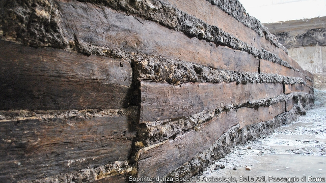

###### Rome’s timber trade

# Some planks from ancient Rome started life in eastern France 

 

> print-edition iconPrint edition | Science and technology | Dec 7th 2019 

THESE OAKplanks, once part of the portico of a property just outside Imperial Rome, travelled a long way before the builders got their hands on them. The science of dating trees by looking at their growth rings is now so good that Mauro Bernabei of Italy’s National Research Council and his colleagues were able to say, in a paper just published in PLOS One, where the trees that provided the planks had grown, and when they were cut. Rings’ thicknesses are affected by the local climate. Comparison with samples of known origin showed that the trees grew in what is now eastern France, and were felled between 40 and 60AD. That speaks of a sophisticated timber trade, which floated the logs down the Saône and Rhône to the Mediterranean, and thence to the Eternal City. 

