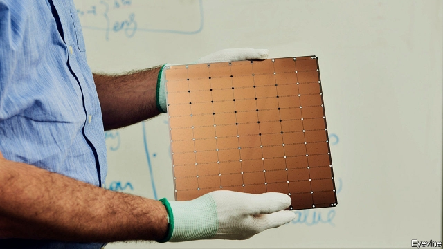

###### Computing records

# The first computer chip with a trillion transistors 

 

> print-edition iconPrint edition | Science and technology | Dec 7th 2019 

SILICON CHIPS have lonely lives. They are born together, often as tens of thousands of identical siblings a few millimetres across, on a single wafer the size of an old-fashioned vinyl record. They are then broken from their natal wafers like squares of chocolate from a bar, and packaged individually in plastic and metal. Only after this is a chip reconnected to others of its kind, as the packages are wired up to work together on circuit boards and inserted into products. 

Many inventors over the years have noted that if chips were instead wired together from the beginning, on the wafer itself, much expense and trouble would be avoided. But efforts to implement such wafer-scale integration have consistently failed, either because the technology just did not work or the resulting circuits could not compete with new versions of conventional designs. 

Now Cerebras, a firm in Los Altos, California, thinks the time is right to try again. The heart of its new product, a supercomputer called the CS-1, could hardly be described as a “chip”. It is a slab of silicon measuring 21.5cm by 21.5cm that the firm refers to as a wafer-scale engine. But whatever name you give it, it is a record-breaker. A high-end modern computer chip might have billions of transistors on its surface. The wafer-scale engine has more than a trillion of them. 

Cerebras’s creation breaks many records besides the trillion-transistor barrier (it actually has 1.2trn). Its transistors are organised into 400,000 individual processing units, known in the trade as cores, and it can shuttle nine petabytes (9,000trn bytes) of data per second around inside itself. For comparison, Intel’s i9-9900k chips, typical of those found in modern PCs, have a mere eight cores and can shuttle 40 gigabytes per second. 

The CS-1 has some notably small numbers, too. Admittedly, IBM’s Summit supercomputer, among the snazziest in the unclassified world, offers some 2.4m cores. However, Summit is constructed conventionally, using package-laden circuit boards. It weighs over 340 tonnes and occupies 520 square metres of floor space. A CS-1 weighs around 250kg and is the size of a domestic refrigerator. It also consumes a mere 15-20kW of electricity. Summit requires 1,000 times as much. 

The purpose of all this computational heft is to run linear algebra, the mathematics of data processing in general and machine learning in particular. Machine learning is at the heart of the trendy and lucrative field of computing branded “artificial intelligence”. 

The CS-1’s compiler—the software that turns programs written by human beings into binary code which a computer can understand—is tuned to keep the flow of data from core to core as efficient as possible. It does this by matching the structure of the code generated to that of the hardware. Also, as the cores are positioned within fractions of a millimetre of the memory they use, that flow of data is already much faster from one part of a circuit board to another than the long-distance trip which would normally be required. 

The wafer-scale engines themselves are made by TSMC, a Taiwanese firm, using a process claimed to be so accurate that each has just 150-200 defects. These are easily worked around, given the number of other transistors available. Wafer-scale integration has many other challenges, such as keeping everything synchronised, pumping in enough electric power, pumping out the resultant heat, and efficiently moving gigabytes of data to and from other parts of a machine. But if the CS-1 survives contact with the real world of commercial use, then wafer-scale integration will at last have proved itself, and the days of the lonely chip may be numbered.■ 

