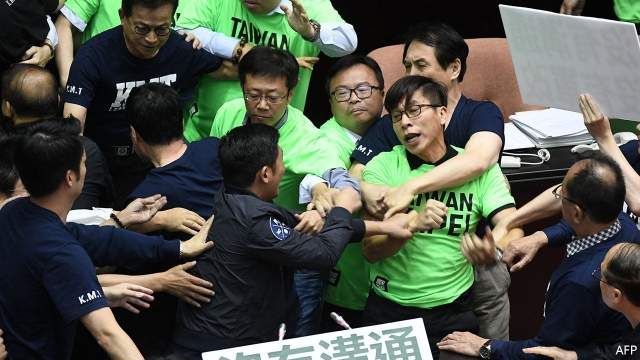

###### Political economies

# Does democracy hurt or help growth in the tiger economies of Asia? 

 

> print-edition iconPrint edition | Special report | Dec 5th 2019 

THE TAIWAN STRAIT is often described as a possible flashpoint. Across this narrow body of water, China points thousands of missiles at the country it regards as a rogue province. But for those working on Formosa 1, an offshore wind farm, the strait is something else. “It’s the best wind in the world,” said one engineer recently, looking out at a cluster of turbines on the turquoise water. 

When up and running later this year, it will be Asia’s first commercial offshore wind farm outside China, and the first of many planned in the strait. Taiwan’s embrace of wind has come alongside a decision to phase out nuclear power. Many businesses fear this will leave the island low on electricity, imperilling its economy. The debate has been unruly at times: legislators have brawled in parliament. In 2017 a massive blackout enveloped the north of Taiwan. But President Tsai is sticking to her plan to create a “nuclear-free homeland” by 2025. For critics, it is a stark example of a political system easily swayed by vocal campaigners, be they environmentalists or anti-free-traders. It also highlights a perennial question: is democracy bad for prosperity? 

This view is, conveniently, often heard in China. “What does Taiwan have to show for 20 years of democracy? Above all, a precipitous decline in its economy,” Zhang Weiwei, a Chinese academic, wrote in an essay. But similar opinions are voiced in some of the tigers themselves. Among the older generation in South Korea and Taiwan, there is nostalgia for Park Chung-hee and Chiang Ching-kuo, the strongmen who led them in their boom years. “You cannot eat democracy,” quipped Terry Gou, the founder of Taiwan’s Foxconn. (Nor could democracy stomach him: he eventually decided not to run in Taiwan’s presidential election after it became clear that he had no chance of winning). 

The freer politics of South Korea and Taiwan have not always covered themselves in glory. Of South Korea’s seven elected presidents since 1987, three were indicted for corruption and one committed suicide to escape a scandal. Of Taiwan’s four presidents since 1996, three have been charged with corruption, one of whom ended up being sentenced to 19 years in prison. All political lives end in failure, as Enoch Powell, a controversial British politician, once said. Few, though, end as badly as in South Korea and Taiwan. 

Hong Kong’s leaders since its handover to China in 1997 are, however, no advert for undemocratic rule either. The first chief executive stepped down early, the second ended up in jail and the third was too unpopular to serve a second term. Meanwhile the current chief executive is so widely disliked that she transformed recent local elections, normally low-key affairs, into a devastating de facto referendum on her rule. Singapore has, for years, hewed more closely to meritocratic ideals, but a feud among the children of Lee Kuan Yew, the country’s founding father, has revealed an uglier side to its elite politics. 

When the four tigers earned that nickname, none of them had ever seen a competitive election. Two of them have since become vibrant democracies; two have not. The quartet therefore provides the kind of variation social scientists want when testing the impact of different variables. The hurly-burly politics of Taiwan and South Korea can be compared with Singapore’s “managed democracy” and Hong Kong’s unrepresentative system, as well as with their own undemocratic past. What do such comparisons reveal? 

Both South Korea and Taiwan grew faster in the decades before they became democracies than they have done since. But Hong Kong and Singapore also grew faster then than they do now. Their shared slowdown cannot, therefore, be blamed on democracy alone. Singapore has grown faster in recent years than the democratic tigers. But Hong Kong has often grown more slowly. 

More systematic studies are similarly mixed in their conclusions. A landmark 1996 paper by Robert Barro of Harvard University reached the “unpleasant” conclusion that too much democracy tended to have a (mildly) harmful effect on growth. He speculated that the redistribution required to appease a majority of voters could dilute incentives for investment and work. His statistical exercises suggested that a middling amount of political freedom was best: about as much, in fact, as Singapore now enjoys. 

But democrats can take heart from the more pleasant conclusions of newer economic research. Daron Acemoglu of MIT and his co-authors calculate that democracy adds about 20% to a country’s GDP per person over the long run. One reason is that it encourages openness and a commitment to education and health. Since Singapore and Hong Kong have remained open and invested heavily in education and health, they have replicated some of the economic benefits of full democracy. 

Democracy’s other contribution to growth, according to Mr Acemoglu and his co-authors, is defusing social unrest. The tigers’ recent experience bears him out. In 2016 South Koreans discovered that their president, Park Geun-hye, had fallen under the sway of a mysterious backstage adviser. This revelation brought millions of protesters onto the streets, just as Hong Kongers’ distaste for mainland influence has brought hundreds of thousands onto the streets since June. 

In democratic South Korea, the political system was able to wrap its arms around the problem. The legislature began formal impeachment proceedings; its verdict was upheld by the constitutional court; Ms Park was removed from power and jailed; and an election was held to find a successor. Meanwhile in Hong Kong, the chief executive, Carrie Lam, appears to lack even the power to remove herself from power, confessing in a leaked speech to businesspeople that she has no choice but to soldier on. 

Because Hong Kong’s half-formed political system has failed to accommodate the protesters’ anger, the police have been left to deal with it. Their task has made the police feel both resentful and powerful. They are the only tool at the government’s disposal, so it is terrified of upsetting them. That fear has stopped the government opening a more credible investigation into police misconduct. But the lack of accountability has enraged the protesters, some of whom see little reason to respect the rule of law if it does not also apply to the law’s enforcers. The stand-off has plunged the economy into a recession that is likely to continue into next year. Whether or not democracy helps growth, the unmet demand for it can certainly hurt. 

There is no question that the tiger democracies, barely a couple of decades old, can be difficult. Formosa 1, the Taiwanese offshore wind farm, has been lambasted in local media as too expensive and has faced eight detailed environmental reviews. The process has been “more intense than in Europe”, says Matthias Bausenwein, president of Ørsted Asia Pacific, the biggest shareholder in the project. But having gone through all that drama, he says that Taiwan’s commitment to wind power looks steadfast. 

In any case, Taiwan’s legislators have new things to fight over. In 2018 another brawl broke out in the legislature, this time about cuts to public pensions. Fisticuffs or not, it is an issue with which all of the tigers must grapple: growing numbers of elderly citizens and what to do about them. ■ 

