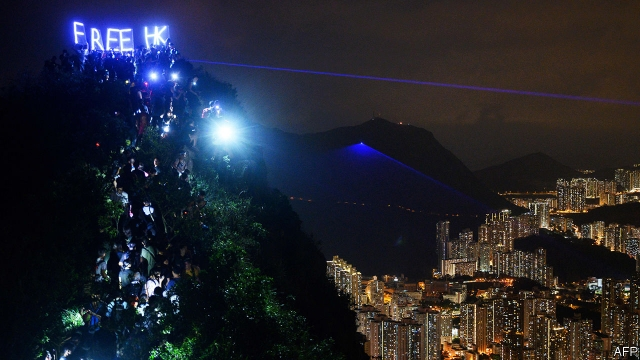

###### Discontent

# Social unrest in places like Hong Kong is not proof of economic failure 

 

> print-edition iconPrint edition | Special report | Dec 7th 2019 

THE MOLOTOV COCKTAILS, one blue, one yellow, arrive swaddled in a towel and wedged in a backpack. Wearing builders’ gloves and Guy Fawkes masks, the protesters balance them casually on a railing, like mixologists in a bar. Then the bricks arrive, piled on a trolley, hidden under a canopy of umbrellas. The protesters spend a few exultant minutes hurling projectiles and insults down the stairs of a subway exit at riot police below. A burst of flames adds drama, and is enough to provoke a response: a canister of tear gas rocketing up the stairs. The protesters disperse, and a row of police march up behind a tessellation of shields, firing gas as they go. 

Once renowned as a city of progress, Hong Kong is now known as a city of protest. Bricks, cocktails and gas have descended on some of the most expensive real estate in the world. The clash described above took place in front of a Bulgari showroom and a branch of Prada. Many analysts, including in Hong Kong’s government, argue that the underlying causes of the city’s protests are economic grievances, especially high housing prices, stagnant wages and the suffocating ubiquity of dominant conglomerates. 

The city is certainly home to vast inequalities. The watches on display in Bulgari sell for more than most residents earn in a month. And the trolleys that now carry protesters’ bricks more typically carry piles of recycled cardboard collected by poor old women, their backs hunched with the effort. Property prices are outlandish. A couple recently sold a parking space in a luxury apartment block for $760,000, equivalent to more than 14,000 parking tickets. 

If economics is the underlying motive for Hong Kong’s unrest, it ought to be possible to satisfy both the protesters and officials in Beijing. A programme of rapid home-building and more progressive taxation would reduce Hong Kong’s inequalities without ruffling China’s feathers: it would, after all, make Hong Kong look more like the mainland. Pro-Beijing legislators in Hong Kong have backed proposals to buy up to 700 hectares (1,730 acres) of land from private developers whether or not they want to sell. 

In a similar vein, many analysts hanker for a Singaporean solution to Hong Kong’s problems. The city-state realised early on that widespread home-ownership was essential to social peace. Over 80% of the population lives in homes built by government agencies, sold at subsidised prices. Phang Sock-Yong of the Singapore Management University says that, as far as housing is concerned, Singapore approximates the “ideal society” envisioned by Thomas Piketty in his book, “Capital in the 21st Century”. The bottom half of households own a quarter of Singapore’s housing wealth. 

But glaring inequality and unaffordable housing are old problems in Hong Kong. They have not prompted mayhem in the past. Why now? And if economic grievances are driving the protesters, they are remarkably silent about their true motives. They typically complain about police brutality and the erosion of Hong Kong’s autonomy before they mention jobs or inequality. “We see the darkness of the government,” said one protester at the Chinese University of Hong Kong (CUHK), angered by the shooting of a vocational student on November 11th. Francis Lee of CUHK and his colleagues surveyed thousands of protesters over the first three months of unrest. Over half identified themselves as middle or upper class and about 75% had received a higher education. 

China would never admit it, but there is a parallel in Taiwan. Wages have stagnated for two decades. Housing in Taipei is among the least affordable in Asia. But one of Taiwan’s biggest political earthquakes in recent years was the “sunflower” protests of 2014, by students opposed to closer trade links with China. Their cause arguably harmed their own economic interests. But it both reflected and fuelled Taiwan’s distinct national identity. 

Although Hong Kong’s economy is not the principal cause of the city’s unrest, it is a prominent casualty. At first, protesters vandalised firms unsympathetic to the cause. More recently, their sabotage has become less discriminate. “We want to give some pressure to the government economically,” said a student. From a barricaded bridge at CUHK, he and other protesters guarded a roadblock of uprooted trees, unscrewed railings and traffic cones, scattered on a busy thoroughfare below. 

Worse than the physical damage is the psychological toll, which affects spending. Retail sales were down by over a fifth year-on-year in September and the number of visitors to Hong Kong fell by over a third. Restaurants and bars have suffered their biggest fall in revenues since the SARS epidemic in 2003. 

If the protests subside, the physical wreckage can be quickly repaired: Hong Kong clears barricades even more efficiently than its protesters erect them. But the harm to sentiment could linger. Mainlanders, who represent over three-quarters of Hong Kong’s tourists, could remain reluctant to spend freely in a city that has made them feel unwelcome. Hong Kong should nonetheless retain its standing as a financial hub. The city’s stockmarket, bond market and banking system dwarf its GDP and remain semi-detached from the local economy. Mainland firms account for 70% of bonds issued and 55% of its Hang Seng stockmarket index. 

The city’s role as a financial conduit between China and the world depends on a distinct legal and regulatory infrastructure that cannot be vandalised or barricaded. Even as the protests raged, Alibaba, China’s e-commerce giant, raised over $11bn on Hong Kong’s stockmarket, the largest haul since 2010. The Hang Seng stockmarket index showed more sensitivity to the Sino-American trade war than to local unrest. And, judging by a 280% spike in stamp-duty payments in October, foreigners can still be convinced to snap up Hong Kong properties by modest dips in price. They perhaps remember the example set by Li Ka-shing, one of Asia’s richest men, who made a fortune buying Hong Kong property during the city’s violent leftist disturbances in the 1960s. 

To some footloose multinationals, Singapore’s stability now looks appealing, compared with the threat of unpredictable commutes and closed schools in Hong Kong. But as financial hubs the two cities are less similar than they appear. In Hong Kong, “we go into China and compete,” says one Singaporean broker who moved to the city years ago. In Singapore, he adds, “they wait for China to come to them,” confident that they can be its gateway to South-East Asia. He likens Singaporean financial professionals to shepherds guarding a flock, whereas Hong Kong professionals are more like hunters prowling for deals. 

The protesters have tried to exploit Hong Kong’s special status for their own ends. By generating international clamour, they have prompted America’s Congress to pass a bill requiring the State Department to assess each year whether Hong Kong remains autonomous enough to justify its separate treatment under American customs, tax and commercial laws. Opposite the CUHK barricades hung the portrait of an unlikely hero: Mitch McConnell, the Republican leader of America’s Senate. 

The irony is that, in many ways, Hong Kong seems ever more distant from the mainland. Many in China cannot understand how the city can be so dissatisfied with so many more privileges than mainlanders enjoy. 

But Hong Kong’s political ambitions are a natural by-product of its prosperity. Although it still enjoys far more freedom than the rest of China, it has fewer political rights than a society of its wealth and sophistication would normally expect. Only oil-rich Gulf states combine both a higher income per person and a lower score on the Democracy Index published by The Economist Intelligence Unit (EIU), a sister company of The Economist. Although Hong Kong’s protests now pose a threat to its progress, they are also a consequence of it.■ 

