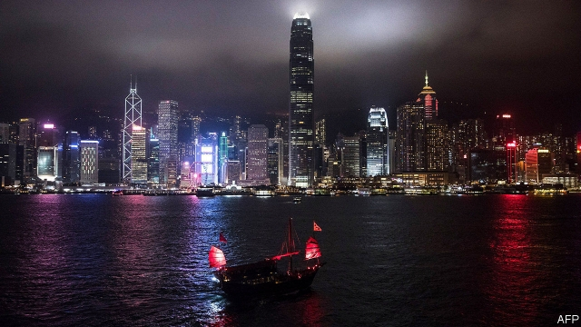

###### The tigers’ future

# Where do the Asian tiger economies go from here? 

 

> print-edition iconPrint edition | Special report | Dec 5th 2019 

EVEN IN THEIR prime, the tigers had their detractors. Twenty-five years ago this month, Paul Krugman, an economist, wrote an article in Foreign Affairs, an American policy journal, entitled “The Myth of Asia’s Miracle”. He argued that Asia’s seemingly dynamic economies displayed, on closer inspection, “startlingly little evidence of improvements in efficiency”. Their growth relied instead on rapidly increasing inputs of labour, capital and so on. It was a miracle based on “perspiration” not “inspiration”. Singapore, in particular, “grew through a mobilisation of resources that would have done Stalin proud”, Mr Krugman wrote. 

This sweaty growth model faced some natural limits. Employment rates could not increase for ever. And the accumulation of capital would eventually run into diminishing returns. Therefore the tigers’ pace of expansion would inevitably slow. 

The comparison that most scares the tigers is with Japan’s elegant stagnation 

On the last point Mr Krugman was unquestionably right. The Asian tigers have averaged growth of 3% this decade, down from 8% in the early 1990s. But their mix of perspiration and inspiration is now better than Mr Krugman feared. As inputs of labour have grown more slowly, total factor productivity, an oft-cited (if theoretically controversial) gauge of efficiency, has made a bigger contribution. Between 2000 and 2017, it grew at least twice as fast in the tigers as in America, according to the Asian Productivity Organisation in Tokyo. 

The comparison that most scares the tigers is not with the Stalinist industrialisation of the Soviet Union but with Japan’s elegant stagnation. Life in Japan is, for many, comfortable and affluent. But its economy has lost ground. Japan’s GDP per person, at purchasing power parity, reached 85% of America’s in 1990; today it is closer to 70%. One cause of Japan’s prolonged slowdown is ageing: it is now older than anywhere except tiny Monaco. But in the coming three decades the tigers will age even more quickly than Japan has done. The tigers also see much of themselves in Japan’s economic model, which once served as an example for their own. South Korea and Taiwan are far stronger in manufacturing than in services and all four are unusually reliant on exports to generate growth in demand. Will they replicate Japan’s failure as faithfully as they copied its success? 

Emulating Japan’s drift would not be a total disaster: many countries, worried about a supposed middle-income trap, would dearly love to fall into the Japan-income trap. But the tigers can still aspire to do better. Despite their parallels with Japan, they are different in many respects. 

Compared with Japan during its bubble years, they are paragons of financial conservatism. Since the market mayhem of the Asian financial crisis of 1997-98, they have insisted on big capital buffers for their banks and pioneered macroprudential limits on borrowing. In addition, the tigers are even more deeply ensconced in the global trading system and have also shown great determination to stay at the global leading edge. All four love to boast of their positions at, or near, the top of global rankings like the World Economic Forum’s global competitiveness index or the World Bank’s “ease of doing business” rankings. 

If the tigers stumble, it will be for their own reasons, not because they are repeating Japan’s mistakes. Taiwan wants to lessen its economic entanglements with China, but that is difficult now that China is the centre of Asian economic gravity. Anger at the concentration of economic power in South Korea has led to demands for a fairer system. But many of the government’s responses have been ineffectual or counterproductive. 

Singapore’s carefully managed political system has come under more strain, and a backlash against immigration shows that it is not immune to the populism that has reared its head throughout the world. Hong Kong, sadly, is the tiger most at risk of going backwards. Its people, successful and sophisticated, understandably want to make big decisions for themselves. Yet their rulers will have none of it. 

So it is only sensible to remain grounded about the tigers. There is still much that can go wrong for them. Nevertheless, there is also much that can continue to go right. They each have plenty of strengths. South Korea has emerged as a research powerhouse, at the same time as building up strong global brands, from smartphones to pop idols. Taiwan, in the toughest of geopolitical circumstances, has made itself an essential player in global supply chains, while also developing a thriving ecosystem of small businesses. Hong Kong, for all its current woes, has established itself as the financial conduit between China and the world. Singapore is top of the tiger class in many ways: it has a diversified economy, despite being a small city-state, and it has mitigated the inequality that has come with its recent flourishing. 

The tigers also matter to the rest of the world. Their record in their boom years remains a vital reference for other developing countries trying to get ahead. Their experience over the past two decades shows how countries can climb from middle-income levels to greater heights. Of particular interest to the developed world will be their record in the coming few decades. 

The quartet can be seen as test cases for the future. They are often the pioneers for new technologies thanks to their innovative firms. And their societies are facing distilled versions of many of the dilemmas now haunting the rich world: how to cope with ageing; how to cushion workers from the effects of automation; how to revive productivity growth; how to stay close to both America and China; and how to push up stagnant wages and hold down soaring property prices. 

Decades before they were nicknamed the tigers, Asia’s smaller economies were likened to a different kind of animal: “flying geese”, fanning out behind Japan. In nature, as in economics, trailing geese find it easier to fly in the leader’s wake, benefiting from the extra lift its wings create. But what the original metaphor forgot is that birds take turns leading and following. Hong Kong, Singapore, Taiwan and South Korea spent decades flying comfortably behind more advanced economies. The good news and the bad is that there is now no one left to follow. ■ 

