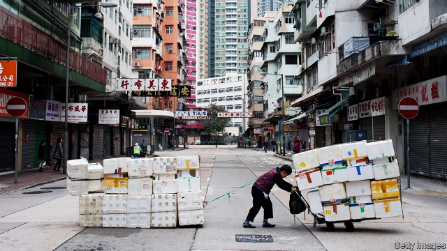
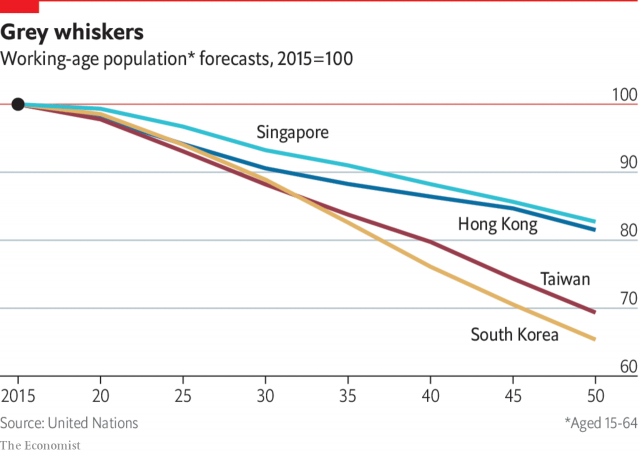

###### Demography

# Will age weaken the Asian tiger economies? 

 

> print-edition iconPrint edition | Special report | Dec 7th 2019 

AT 4.30AM hundreds of people are already spilling into the road outside Seoul’s Namguro station. They are not here for the trains, which will not begin for another hour. Nor are they attracted by the dawn cafeterias (offering blood sausage and flatbread), the upstairs song rooms (offering the comforts of crooning) or the basement spas (offering who knows what). They are gathered instead to offer their labour in return for a day’s wages, at whatever building site needs extra hands. As they wait for a bidder, they smoke, squat and cough. And they speak not in Korean but in gravelly Mandarin. 

South Korea used to be a net exporter of labour. In the 1970s its workers built roads in Saudi Arabia, often at night by torchlight. But immigrants, including the Chinese gathered at Namguro, now make up a growing proportion of the workforce. 

For all the fear in the tigers about jobs, their unemployment rates remain enviably low: less than 4% in all of them. Their long-term worry will be a shortage not of jobs but of people young enough to do them. The population of traditional working age (aged 15-64) is already declining in all four. By 2040 they will have fewer people in this age bracket, relative to their elderly population, than Japan has today. In a span of 20 years, the tigers will have aged as much as Japan did in more than 30. 

The tigers’ fertility rates rank in the bottom ten worldwide: low enough that each new cohort is expected to be only 55% the size of its parents’ generation. Their governments have tried, without much subtlety or success, to reverse this trend. Some have even tried their hand at matchmaking. Singapore’s Social Development Network organises dinners, films and board games. One network-certified dating agency will help you find your ideal partner with the help of Lego bricks. In Taiwan the government has organised speed-dating and bike tours, among other events. But one senior official is blunt in her assessment: “Totally useless.” 

 

One reason is the tigers’ work culture. “If a country requires its people to be locked up in their workplace, no wonder the birth rate is so low,” says Joyce Yang, who quit her public-relations job in Taipei after too many midnight finishes to the day. In South Korea, President Moon’s government has cut the maximum workweek to 52 hours (although exceptions persist). Ms Yang chose a more radical solution: moving to Australia, from where she urges her 30,000 Facebook followers to quit their workaholism. “Taiwanese don’t have time for life,” she says. 

Time is one constraint; another is cost. Although society as a whole benefits from the vigour of each new generation, the cost of raising them falls squarely on one group: women of childbearing age. With elderly parents to worry about, little help from their husbands (men do only a fifth of the household chores in South Korea) and inadequate help from the state, many women have chosen to marry late, if at all, and have one child, if any. 

Their predicament is worsened by one of the tigers’ proudest boasts: their commitment to education. Although the tigers all provide decent public schooling, many parents feel obliged to splash out on expensive private alternatives and additional tutoring. Some of this extra effort may add to a child’s knowledge and future productivity. But much of it is mere credentialism, an attempt to improve a child’s position in the queue for the best universities, and hence the best jobs. Education has become an arms race in which one parent’s additional outlay of time and money forces others to follow suit. 

Education has become an arms race…Tiger parents risk hurting the tigers 

In South Korea, Mr Moon has promised various acts of collective educational disarmament. He wants to merge universities into a single network, flatten the schools hierarchy and even discourage employers from hiring on the basis of academic credentials. Some of these proposals seem unworkable. His critics call it a “war on meritocracy”. But there is a distinction between merit, which should be rewarded, and wasteful attempts to signal merit, which are damaging. Tiger parents risk hurting the tigers. 

Faced with this burden, some parents fabricate their children’s qualifications. One academic paper in 2009 on the genetic precursors of disease was supposedly co-written by the daughter of Cho Kuk, Mr Moon’s justice minister, even though she was only a schoolgirl at the time. He was forced to resign in shame. 

To improve their unfavourable age structure, the tigers will have to combine shorter working weeks with longer working lives. They will need more people like Neo Kwee Leng. As he approached 60, he gave up his life as a small businessman to spend his days at the “Loving Heart” centre, an activity hub for the elderly in Singapore. It was not an act of retirement: he joined as a manager. Nor, as it turned out, was it much of a downshift. About 100 people drop in daily, each with different needs. Some come for medical check-ups, others to play ukulele, still others just to chat. 

So Mr Neo upgraded his managerial skills, learning Excel and data analysis. “The hardest part is my eyesight,” he says. He has also run seminars on using smartphones. His training—of himself and others—is part of SkillsFuture, a government programme to promote lifelong learning. 

In the tigers, lifelong can be lengthy indeed. Just as they have some of the lowest fertility rates, they also have some of the highest life expectancies. Even at 60 their people can still expect to live another 25 years or more, enough time to master both Excel and the ukulele. 

Another way for the tigers to cope with their ageing is to permit more immigration. The foreign population accounts for 6% of the workforce in Taiwan and about 3.3% in South Korea. That is low by Western standards, but higher than Japan, where foreigners make up only 2%. In the two tiger cities the reliance on immigrants is far more dramatic. Much of Hong Kong’s population (39%) was born elsewhere, including over 2.2m from other parts of China. The foreign-born still occupy prominent positions in the courts, regulatory bodies and even the police. The city also relies on over 380,000 maids and nannies (mostly from the Philippines and Indonesia), who constitute over 8% of the workforce. 

Singapore has 1.4m foreign workers, more than a third of its labour force. The government believes immigrants are needed to do the lower-skilled jobs that Singaporeans will no longer do. A white paper in 2013 forecast a population of up to 6.9m by 2030, from 5.7m today. In so doing, it inadvertently revealed the limits of openness in the city-state. The projection fuelled worries that immigrants would overburden the city’s infrastructure and public services. In the rarest of scenes for Singapore, a few thousand people protested in a park, some holding aloft signs such as “Singapore for Singaporeans”. 

Immigration is not the only way to take advantage of more abundant workforces elsewhere. As well as importing labour, the tigers can, and have, exported capital. By lending and investing abroad, they have accumulated claims on the output of foreign workforces, without all the difficulties of bringing those workers to their shores. In Hong Kong, the net annual income from these foreign assets already amounts to almost $2,500 per person. 

The tigers have accumulated these overseas investments by consistently selling more things to the rest of the world than they buy from it. Singapore’s current-account surplus last year was a whopping 18% of GDP. These trade imbalances have not yet provoked much scrutiny or condemnation from America. But that could change. These four economies are, after all, worthy of the world’s close attention.■ 

