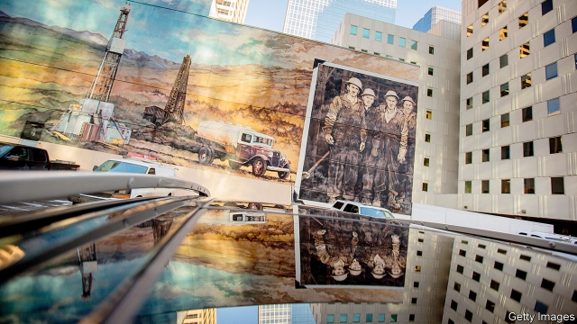
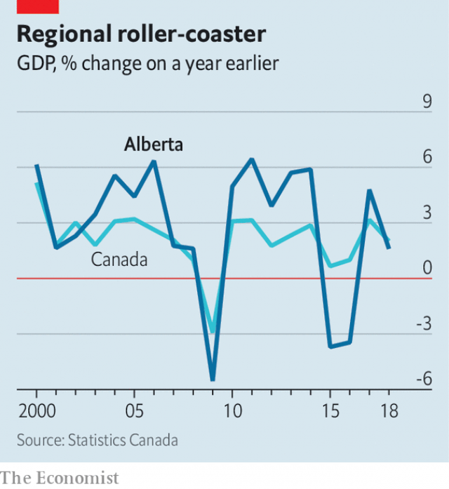

###### The Wexit wave

# Alberta’s secession movement spells trouble for Justin Trudeau 

 

> print-edition iconPrint edition | The Americas | Dec 7th 2019 

THE 700 PEOPLE who gathered on a recent Saturday night at the Boot Scootin’ Boogie Dancehall in Edmonton, the capital of the western Canadian province of Alberta, came not to boogie but to vent. Baseball caps for sale bore such slogans as “Make Alberta Great Again”, “The West Wants Out” and “Wexit”. On stage, before a Canadian flag held between hockey sticks and pointed upside down, Peter Downing recited the grievances that drew the crowd: cancelled plans to build oil pipelines, subsidies paid to the rest of Canada and snobbery towards Alberta from the central Canadian provinces. The country’s prime minister, Justin Trudeau, would get what’s coming to him, Mr Downing pledged. Someone near the back muttered, “Hopefully, a bullet.” 

The anger at the Boot Scootin’ would be easy to ignore, except that it will be one of the dominant themes of Mr Trudeau’s second term in office, which began when he narrowly won re-election in October. His Liberal Party was wiped out in Alberta and in its equally resentful neighbour, Saskatchewan. Mr Trudeau appointed Alberta-born Chrystia Freeland, the foreign minister in the last government, to be deputy prime minister and minister of intergovernmental affairs. One of her main jobs will be to soothe western feelings. Canada’s governor-general was expected to outline the government’s ideas for bridging regional divisions, among other priorities, in a “speech from the throne” as The Economist went to press on December 5th. They are unlikely to include a big reduction in Alberta’s net transfers to the rest of the country. But its drive for greater autonomy could be a model for reshaping how the federation works. 

Alberta’s 4m people are Canada’s richest. The province is a motor for the national economy when oil prices are high. It is a big net contributor to the federal budget and to other provinces. Alberta was also the fulcrum of Mr Trudeau’s climate and energy policies. He had hoped to win its support for a national price on carbon by approving the expansion of the Trans Mountain oil pipeline to the country’s west coast. The province rejected this grand bargain by scrapping the carbon tax on consumers. 

 

Though rich, Alberta has had a run of bad luck. It began when global oil prices fell in 2014, causing a recession and a jump in unemployment to a high of 9% in 2016 (see chart). The economy has since recovered, but Alberta still struggles to sell its oil. In part that is because existing pipelines are full. This forces producers to ship oil expensively by train to the United States, where it competes against cheaper American shale oil, or to store it. Extracting oil from Alberta’s oil sands consumes a lot of energy, and it is harder to refine than lighter crudes. Each barrel contributes more to climate change than does one from most other sources. 

These problems have led to an exodus of oil companies. Shortly after the election Encana said it would move its head office from Calgary, Alberta’s business centre, to Denver. It is changing its name to Ovintiv. In November this year Sweden’s central bank said it would sell its holdings of bonds issued by Alberta because its carbon footprint is too large. Royal Dutch Shell has sold almost all its oil-sands assets. 

Albertans blame many of these setbacks on Mr Trudeau. He is the son of a prime minister, Pierre Trudeau, who during the 1970s and 1980s forced Alberta to sell its oil domestically at a discount to world prices. Although Mr Trudeau’s government bought the Trans Mountain pipeline and the project to expand it, which is to begin laying pipe this month, it has vetoed other pipeline projects. Canada needs to phase out the oil sands, he has said. The national carbon price, which will be imposed on Alberta after it scrapped its own scheme, is another insult to the oil patch. Albertans are just as angry about an overhaul of the law for giving regulatory approval for infrastructure projects, including pipelines. This gives the public more say and obliges builders to consider such issues as climate change and gender equity. 

A third of Albertans now think they would be better off outside Canada, the highest level on record, according to a poll by Ipsos. In November advocates of Wexit—western exit—applied to be recognised (by the federation they want to leave) as a political party. Wexit Canada imagines that if Alberta secedes, neighbouring British Columbia—which resembles California the way Alberta does Texas and has a coast—will have no choice but to join it. 

Alberta’s leaders, and most Albertans, are more realistic. Among the hurdles on the road to separation are old treaties signed by indigenous First Nations with Canada’s rulers. These would be difficult to change. Moreover, separatist sentiment caused one firm to cancel plans to put its headquarters in Calgary. That cost the city 1,000 jobs, says its development agency. 

Last month the province’s canny Conservative premier, Jason Kenney, argued that separation would landlock Alberta’s oil. He said he would host town halls and convene a panel with a more modest aim: to devise a “fair deal” for Alberta within Canada. This is likely to be a package of measures that the province can take unilaterally. They may give Alberta a status within the confederation closer to that of Quebec, the French-speaking province. 

Mr Kenney’s fair deal is likely to include a new force to take over provincial policing. Quebec and Ontario already have forces that operate alongside the Royal Canadian Mounted Police. Alberta, rather than the central government, might collect revenues destined to be spent within the province, as Quebec now does. The province may also try to opt out of some federal programmes, such as the Trudeau government’s plan to pay for patients’ prescriptions. Alberta could withdraw from the Canadian Pension Fund as long as, like Quebec, it sets up one with comparable benefits. That might lower Albertans’ contributions (because its population is relatively young) and raise those of other Canadians. Many of these measures would increase administrative costs, which is one reason the province has rejected such ideas in the past. Quebeckers, for example, complete two tax returns. 

On most money matters Alberta can do little on its own. Since 2000 the difference between what it has sent to the federal government and what it receives in transfers and services has amounted to 8% of the province’s GDP. Much of the anger focuses on “equalisation”, a transfer from rich provinces to poorer ones, mainly Quebec, that is supposed to even out social spending. During the provincial election campaign in May, Mr Kenney promised to hold a referendum on equalisation if the federal government did not expand the Trans Mountain pipeline. 

It would have no legal force. Mr Trudeau is unlikely to cut Alberta’s subsidy to the rest of Canada, even though it largely derives from oil dollars. Nor is he likely to scrap his environmental policies. He and Ms Freeland will no doubt seek other ways to placate the west. But these will probably not overcome its sense of alienation. Wexiteers may be gathering at the Boot Scootin’ dance hall for years to come. ■ 

