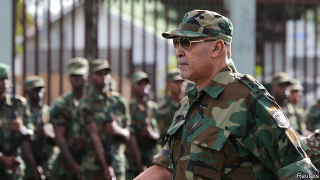

###### Unjust desserts

# Desi Bouterse’s murder conviction will not trouble him much 

 

> print-edition iconPrint edition | The Americas | Dec 7th 2019 

TWO DAYS after a military court found Desi Bouterse, Suriname’s president, guilty of murdering 15 political foes, he returned home from a visit to China. A throng of supporters, many wearing the purple of his National Democratic Party, turned up to greet him at Paramaribo’s international airport on December 1st. Mr Bouterse brought back a promise of $300m to upgrade airports and roads and install solar power and 5G internet services. But the welcome was a defiant show of loyalty to a leader who has dominated his tiny country’s politics for four decades. 

Mr Bouterse’s conviction for murders that took place in 1982, and the 20-year sentence that goes with it, are unlikely to dislodge him. He helped lead a “sergeants’ coup” against an elected government in 1980, five years after independence from the Netherlands. He was elected democratically as president in 2010 and re-elected five years later. He may well repeat that feat next year. Few Surinamese expect Mr Bouterse to serve a day of his sentence. The appeal process could drag on for ten years, says the vice-president, Ashwin Adhin. 

The murder victims were foes of Mr Bouterse’s regime—journalists, lawyers, scholars, soldiers and businessmen. Fearing a counter-coup backed by the Netherlands, the regime rounded them up at night and held them in Fort Zeelandia, built in the 17th century. They were summarily tried, then tortured and shot. Mr Bouterse claimed at the time that they had been trying to escape. 

He went on to fight a civil war. This pitted the army against disgruntled ethnic groups, especially Maroons, descendants of escaped slaves. In 1986 the army massacred 39 people in the home village of the Maroons’ leader. Democracy was restored in 1991, under a coalition of parties that had not taken part in the war. 

In 2000 a newly elected government set in motion a magistrate’s inquiry into the murders of 1982, just ahead of the deadline set by the statute of limitations. Mr Bouterse and 25 others, mostly army officers, were indicted in 2004. He accepted political responsibility for the murders but has never admitted guilt. Since a Dutch court convicted him of trafficking cocaine in 1999 he has avoided visiting or even passing through the Netherlands, where he could be arrested. 

Surinamese overlook his chequered reputation. A charismatic strongman with a jokey man-of-the-people style, Mr Bouterse outshines rival politicians. The ethnic tensions that sparked the civil war no longer define politics. 

Mr Bouterse says he will be a candidate in the legislative election, due to be held in May. The president is elected indirectly, either by a two-thirds majority of the legislature or, if that fails, by a simple majority of a “united people’s assembly”, composed of all elected national and local representatives. Mr Bouterse can probably extend his hold on power, if he wants to. 

That would alarm democrats. They worry that part of the money from China will pay for a “safe city” project, which includes technology to track licence plates, and a facial-recognition surveillance system. But at 74 Mr Bouterse is showing his age. He may step aside for Mr Adhin or someone younger. If he decides to run, he is more likely to serve a third five-year term as president than a 20-year murder sentence.■ 

