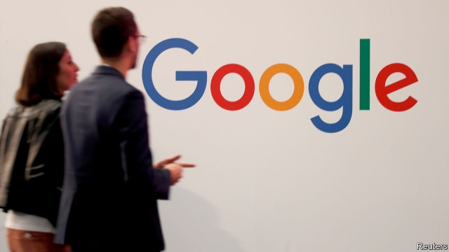
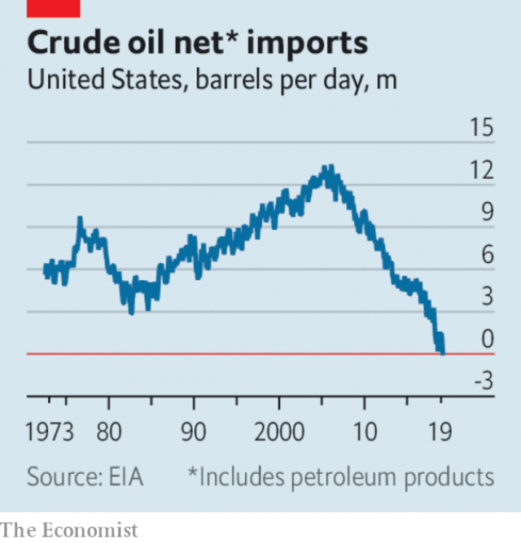

###### Our election endorsement

# Business this week 

 

> Dec 7th 2019 

In an unexpected move, Sergey Brin and Larry Page stepped down from their respective roles as president and chief executive of Alphabet, Google’s parent company. The pair founded the internet giant in a garage while at Stanford in 1998. They will retain their combined voting majority in the company and continue to sit on the board. Sundar Pichai becomes Alphabet’s chief executive in addition to his job running Google, expanding his brief to oversee “moonshot” projects, such as driverless cars and electricity-generating kites. Messrs Brin and Page assured Mr Pichai they would still be around to offer “advice and love, but not daily nagging.” See article. 

Stockmarkets had an unsettled week amid uncertainty about America and China reaching a trade deal before December 15th, when tariffs are due to rise on a raft of Chinese goods. Donald Trump’s ruminations about being prepared to wait until after November’s presidential election to reach an agreement spooked investors at first, but was then dismissed as a negotiating tactic. See article.  

Mr Trump said he wanted to raise tariffs on metal imports from Brazil and Argentina, accusing both countries of manipulating their currencies. Finding himself on a roll, the president also threatened to impose 100% tariffs on $2.4bn-worth of French goods, including champagne, after the United States Trade Representative found that France’s digital tax discriminates against American companies such as Amazon, Facebook and Google, and is “inconsistent with prevailing tax principles”. See article. 

The World Trade Organisation rejected the European Union’s claim that it no longer provides illegal state aid to Airbus, a second victory in recent months for Boeing in the pair’s 15-year dispute. In response the USTR said it would look to increase the retaliatory tariffs it imposed in October on a range of European goods following the WTO’s first ruling. 

In contrast with souring trade relations elsewhere, Japan’s Diet approved a trade deal with America that slashes tariffs on American beef and pork imports in return for lower levies on Japanese industrial goods. The limited agreement is a substitute for a Pacific-wide trade pact that Mr Trump withdrew America from. Separately, Japan’s government unveiled a larger-than-expected ¥13trn ($120bn) spending plan to stimulate the economy. 

Brazil’s GDP was 1.2% higher in the third quarter than in the same three months last year. The pace of its economic expansion is quickening following a severe recession in 2015-16. Consumer spending and business investment rose in the quarter, helped by falling interest rates. 

Also pulling out of the doldrums, Turkey’s economy expanded by 0.9% in the third quarter, following nine months of contraction. Growth was spurred by agriculture and industry. Construction, which has been championed by the government, continued to struggle, shrinking by 7.8%. 

UniCredit, Italy’s biggest bank, said it would cut 10% of its workforce, close 500 branches and take other measures to cut costs, as it seeks approval for a €2bn ($2.2bn) share buy-back programme. After years of paltry profits, it is rare for a European bank to return cash to investors; UniCredit must convince the European Central Bank that it can do so without weakening its capital buffers. See article. 

 

America exported more crude oil and refined petroleum products in September than it imported, the first time it has been a net exporter of oil for a whole month since records began in the 1940s. Boosted by production from lighter shale oil, America’s net exports averaged 89,000 barrels a day in September, the difference between the 8.7m it imported and the 8.8m it exported. American refineries still rely on heavier foreign crude oil. 

In the wake of LVMH’s offer to take over Tiffany, more consolidation beckoned in the luxury-goods industry as Kering, a French group that includes the Gucci and Saint Laurent brands in its stable, was said to be interested in buying Moncler, an Italian skiwear-maker. 

Mike Pompeo, America’s secretary of state, strongly urged European countries to shut out Huawei from building 5G networks, because of fears over data security. The EU is to discuss the matter at a forthcoming meeting. Huawei responded angrily, describing Mr Pompeo’s allegations as “defamatory and false”. 

The UN announced that Mark Carney will become its envoy on financing climate action when he steps down as governor of the Bank of England next year. The job may present more headaches for Mr Carney than Brexit ever did. This week’s climate-change summit in Madrid declared the past decade to be the hottest on record. New research suggested that emissions may have declined in America and the EU this year, but risen in China, India and the rest of the world. 

