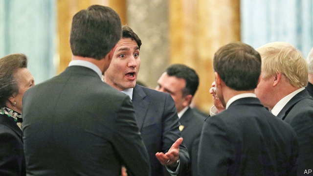
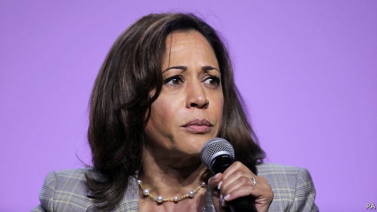

###### Our election endorsement

# Politics this week 

 

> Dec 7th 2019 

The political leaders of NATO countries gathered in London for a meeting. Donald Trump sparred with both Emmanuel Macron, the president of France, who recently described the military alliance as being in a state of “brain-death”, and with Justin Trudeau, Canada’s prime minister, who was caught on camera mocking the American president. Despite these mini-rows, NATO, at 70 years old, is in better shape than it sometimes looks. See article. 

Germany expelled two Russian diplomats in retaliation for the killing of a Chechen separatist in Berlin in August. The government has been slow to act over the case. 

Finland’s prime minister, Antti Rinne, resigned after a key political ally withdrew support. He had been in office for just six months. 

The prime minister of Malta, Joseph Muscat, said he would stand down, though not until January, as allegations over the murder of an investigative journalist who had been looking into official corruption threatened some of his closest associates. See article. 

With a week to go before an election, Britain’s political parties tried to limit last-minute blunders. Boris Johnson, the Conservative leader, continued to dodge scrutiny from the BBC’s fiercest interviewer, who has already mauled other candidates. The Tories enjoy a ten percentage-point lead, but are worried they may again fail to get a majority. See article. 

Two people were murdered in London by a convicted terrorist at a conference on prison education. He had been released on temporary licence. Questions were raised about the effectiveness of a rehabilitation programme for jihadists, which the killer, who was tackled by the public and shot dead by police, had completed. See article. 

A military court in Suriname convicted the country’s president, Desi Bouterse, of murder and sentenced him to 20 years in prison. In 1982 soldiers killed 15 opponents of the military regime then led by Mr Bouterse. He will not begin his sentence until a decision is made on his appeal. He may be re-elected president next year. See article. 

A court in Honduras sentenced the killers of Berta Cáceres, an environmental activist, to 50 years in prison. She was murdered in 2016 after campaigning to prevent the building of a dam that would have flooded land inhabited by the Lenca people, an indigenous group to which she belonged. 

Adel Abdul-Mahdi, the prime minister of Iraq, said he would step down amid large protests over corruption, poor governance and unemployment. His resignation is unlikely to satisfy the demonstrators, who want other changes too. The authorities have killed over 400 people since October, when the unrest began. See article. 

Human-rights groups said up to 450 Iranians were killed during protests over a rise in the state-controlled price of fuel last month. The regime was accused of trying to hide the scale of its crackdown by shutting down the internet. See article. 

Hage Geingob won a second term as president of Namibia in an election overshadowed by claims of corruption against senior members of SWAPO, which has ruled since the country’s independence in 1990. Two former ministers have been arrested on allegations of bribery in connection with the allocation of fishing rights to Iceland’s biggest fishing firm. 

The UN’S World Food Programme said it will double the number of people it is feeding in Zimbabwe to 4.1m, as rising inflation and a collapsing economy push nearly 8m people into hunger. 

The government of Singapore used its new “fake-news” law for the first time, ordering Facebook, among others, to publish a notice next to a post explaining that the authorities deemed it to contain falsehoods. See article. 

Australia’s government repealed a law allowing asylum-seekers held in offshore detention centres to be brought to Australia for medical treatment under exceptional circumstances. It argues that the measure encouraged unauthorised immigrants to try to reach the country by boat. 

During a surprise visit to Afghanistan, Donald Trump said that America would resume peace talks with the Taliban. He also implied that a ceasefire would be part of any deal—an idea the Taliban have long resisted. See article. 

China said it had suspended port calls in Hong Kong by American navy vessels in response to America’s new law in support of democracy in the territory. China also reacted angrily to the passage by America’s House of Representatives of a draft law that would require sanctions to be imposed on Chinese officials for violations of human rights in the far-western region of Xinjiang. 

Riot police clashed with hundreds of people protesting in Wenlou, a town in southern China about 100km from Hong Kong, over the building of a crematorium. The police fired tear-gas and reportedly beat and detained dozens of protesters. 

Russia activated a 3,000km natural-gas pipeline to supply the Chinese market. The pipeline cost $55bn and will provide 38bn cubic metres of gas a year to China by 2024. 

The impeachment proceedings against Donald Trump moved to the House Judiciary Committee, after the Intelligence Committee released its report, finding that the president “subverted US foreign policy towards Ukraine…in favour of two politically motivated investigations”. The Judiciary Committee will now consider whether to bring formal charges. See article. 

The Senate confirmed Dan Brouillette as America’s energy secretary. He replaces Rick Perry, one of the “three amigos” who managed Mr Trump’s contacts with Ukraine.  

 

Kamala Harris withdrew from the Democratic race for president. A year ago Ms Harris was seen as a possible front-runner for the nomination, but she never hit her stride, squeezed between her party’s progressive and moderate wings. Joe Biden said he would consider her as a possible running-mate, should he win. See article. 

Lori Lightfoot, the mayor of Chicago, sacked Eddie Johnson as chief of police. Mr Johnson led America’s second-biggest police force through a tumultuous three years. But Ms Lightfoot said she fired him for lying to her about an incident where he was found asleep at the wheel of his car. Mr Johnson said he didn’t “intentionally mislead or deceive” anyone. 

