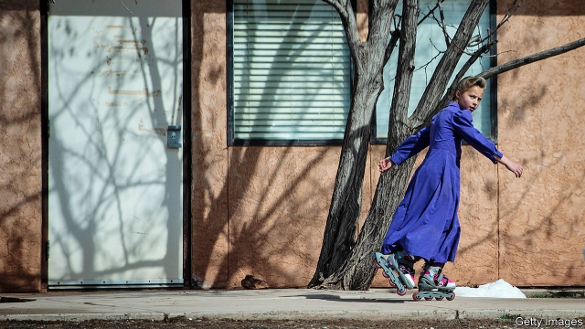

###### Theocracy in America

# Short Creek starts to move beyond its past as a fundamentalist fief 

 

> print-edition iconPrint edition | United States | Dec 7th 2019 

JUDGING BY its shops, Short Creek seems more like a trendy suburb of somewhere like Portland than a small town on the Utah-Arizona border with just shy of 8,000 people. There are two health-food stores, a bakery and a vape shop. The occasional sight of women in prairie dresses and the huge houses with thick walls are the only conspicuous evidence Short Creek was once home to an American theocracy. 

When the Church of Jesus Christ of Latter-Day Saints (LDS), better known as the Mormon church, abandoned several controversial doctrines in 1890, there were dissenters. Some, seeking to preserve abandoned institutions such as “plural marriage” (polygamy) and communal ownership, formed communities practising “Old-Fashioned Mormonism”. By the early 1930s Short Creek was such a place. 

The settlement was largely ignored by the outside world, apart from the occasional court case over polygamy and an ill-advised raid by the state of Arizona in 1953, when 263 children were taken from their parents and held for up to three years, inciting widespread sympathy for the town. Short Creek ultimately incorporated as two places: Hildale City, Utah in 1962 and Colorado City, Arizona in 1985. It was not until the turn of the century that outsiders started paying attention again. 

Short Creek’s church, by then called the Fundamentalist Church of Jesus Christ of Latter-Day Saints (FLDS), had long been headed by a “prophet”. The church’s most famous, Warren Jeffs, assumed the title in 2002. By excommunicating dissenters—which meant ostracisation by believers, even spouses and children—Mr Jeffs took control of the priesthood and therefore of the town’s resources and government, as most residents and city office-holders were church members. He began to exercise total authority over relationships, starting by marrying many of his stepmothers. He removed all FLDS children from public school and banned television, books other than approved scripture, toys and red clothing. Mr Jeffs was arrested in 2006 after a stint on the FBI’s most-wanted list for charges related to sexual abuse of a minor. He is serving a life sentence in Texas. 

Mr Jeffs’s arrest did not end Short Creek’s legal troubles. The United States began court proceedings against Colorado City and Hildale City in 2012, alleging that city officials and local utility providers had acted in concert to “deny non-FLDS individuals housing, police protection, and access to public space and services”. The FLDS filled the local marshal’s office with loyal members who turned a blind eye to under-age marriages and food-stamp fraud. The marshal’s office trained and equipped a formal security force, called “Church Security”, with the primary purpose of helping church leaders evade the law. They held mock FBI raids to be ready for the real thing, and even helped burgle the business of an ex-FLDS member who had evidence that Mr Jeffs had raped a 12-year-old in the presence of other girls. 

The two cities lost their case in 2016. Both then appealed, though Hildale City withdrew in 2018. The ruling was upheld by the Ninth Circuit Court of Appeals in August of this year. 

Over the course of the proceedings, Short Creek has changed dramatically. Many true believers have moved away, while the town has seen both the return of ex-FLDS members and an influx of newcomers. Though the government of Colorado City is still controlled by FLDS members, Hildale City elected non-FLDS councillors and an ex-FLDS mayor in 2017, causing a number of FLDS city employees to resign. 

Most of the towns’ businesses opened recently. The Edge of the World Brewery served its first beer in March 2018. The Black Cloud vape shop opened three months later. Few FLDS-run businesses remain. And the children have returned to class. An old FLDS storehouse has since become Water Canyon High School. 

With these changes has come a newfound democratic zeal. At a town-hall meeting on October 21st the citizens of Hildale City debated paving the town’s many dirt roads. Mr Jeffs’s name came up only one time, invoked by a man who had moved in relatively recently. There is a long road still to travel to escape Mr Jeffs’s legacy, but the community of Short Creek has set off in the right direction.■ 

