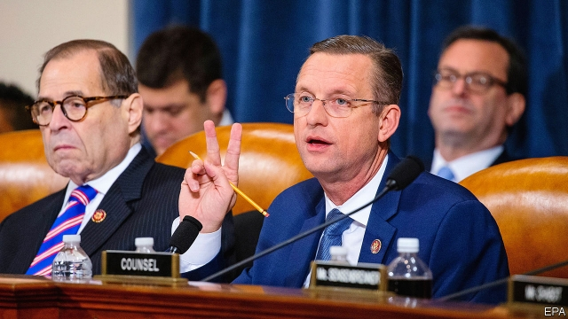

###### Uncommon grounds

# The impeachment inquiry enters its next phase 

 

> print-edition iconPrint edition | United States | Dec 5th 2019 

DOUG COLLINS, the highest-ranking Republican on the House Judiciary Committee, and Bernie Sanders, the socialist senator from Vermont seeking the Democratic nomination for president, differ in almost every way but one. They both have just two volume settings: full and off. On December 4th Mr Collins’s committee invited four law professors to testify about the constitutional basis for impeachment and the nature of impeachable offences. In his opening statement, Mr Collins, a law-school graduate himself, peered at the four witnesses present and shouted, “Hey, we got law professors here! What a start of a party!...America will see why most people don’t go to law school!” 

Of course, any congressman-law professor colloquy risks breaking the logorrheic scale. And Wednesday’s hearing uncovered no new facts. But it was not intended to: the professors were there to define terms before the committee decides, perhaps by next week, whether to draw up articles of impeachment. Yet the two parties’ strategies, in both the hearing and their reports about the House Intelligence Committee’s findings, remained relatively constant, with Democrats focused on Mr Trump’s actions, and Republicans on process. They are playing to different crowds. Democrats are trying to shift public opinion, which is probably a fool’s errand. Republicans are trying to prevent significant congressional defections, at which they will probably succeed. 

The Democrats’ report is precise, forensic and thorough. Like the Mueller report, it has two sections: the first focusing on Mr Trump’s actions regarding Ukraine, and the second on conduct that Democrats believe has obstructed their investigation. 

According to their report, Mr Trump’s efforts to pressure Ukraine’s president, Volodymyr Zelensky, into investigating Joe Biden did not consist of just one phone call. It was a sprawling, months-long campaign spearheaded by Rudy Giuliani, Mr Trump’s personal lawyer. Call records show extensive contact between Mr Giuliani and the Office of Management and Budget, which implemented the hold on Ukraine’s assistance funds; as well as Mike Pompeo, the secretary of state, and Devin Nunes, the highest-ranking Republican on the House Intelligence Committee. Mr Giuliani also received calls from someone listed just as “-1”, who tended to ring soon after he called or texted White House numbers. 

The report concludes that Mr Pompeo, Vice-President Mike Pence, Mick Mulvaney, the chief of staff, and others were “knowledgeable of or active participants in” Mr Trump’s efforts to make military assistance conditional on Ukraine announcing investigations that would be of personal political benefit to him. 

It also lays out which officials declined to take part in the impeachment inquiry and what information Congress wants. The report argues that Mr Trump’s blanket refusal is unprecedented—Andrew Johnson, Richard Nixon and Bill Clinton all complied with House requests for information—and that such defiance represents “an existential threat to the nation’s constitutional system of checks and balances...and rule of law”. 

The Republican report rejects virtually all those claims. It paints the impeachment inquiry as an effort “to undo the will of the American people”. It argues that no evidence establishes that Mr Trump pressured Ukraine, orchestrated a “shadow foreign policy” or “covered up the substance” of his conversation with Mr Zelensky. It notes, correctly, that Ukraine has a history of corruption, and that during the 2016 election some Ukrainian officials were publicly sceptical of Mr Trump, which, given his avowed fondness for Russia and their oppression by it, makes sense. Some of Mr Trump’s defenders have tried to equate these isolated, individual statements of preference with Russia’s extensive, covert meddling in the 2016 election, but the two things are not remotely similar. 

The two sides continued speaking past each other at the hearings. The three professors whom Democrats invited all testified that Mr Trump had committed impeachable offences; the lone invited by the Republicans disagreed. It sounded as though Democrats were laying the groundwork to draw impeachment articles on abuse of power and obstruction. 

That will not change public opinion. Support for impeachment rose steeply, to around 50%, after the inquiry began, but there it has stayed, just as Mr Trump’s approval rating has remained in the low 40s. Without an unlikely shift, congressional Republicans will still fear a primary challenge from the right, if they support impeachment, more than a general-election loss. Which means that Mr Trump still looks likely to be impeached, but then tried and acquitted.■ 

