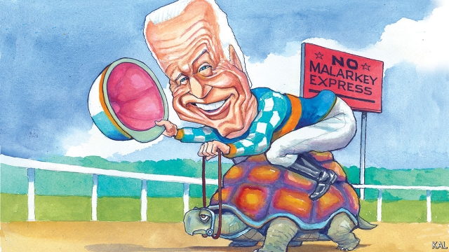

###### Lexington

# The stickiness of Joe Biden 

 

> print-edition iconPrint edition | United States | Dec 7th 2019 

IT WOULD BE too much to describe Joe Biden’s “No Malarkey” bus tour through Iowa this week as a desperate measure. Despite much negative commentary on his candidacy, the former vice- president continues to lead the Democratic primary field in national polls. With strong support from African-Americans, who like his loyalty to Barack Obama and don’t love his rivals, he is also ahead in second-phase primary states such as Nevada and South Carolina. Yet in Iowa and New Hampshire he is now trailing Pete Buttigieg, Bernie Sanders and Elizabeth Warren. And as few candidates have lost those early states and still won the nomination, his eight-day, 650-mile tour through icy Iowa had a lot riding on it. 

One long day on the trail started in Emmetsburg, northwestern Iowa, across the road from a Lutheran retirement home. The white-haired crowd might have been made up of its residents. Biden supporters skew old, as pollsters say. Perhaps that makes them more forgiving of the 77-year-old’s regular befuddlements; he recently confused last year’s Parkland school shooting, which left 17 dead and the youthful Democratic base aroused in anger, with the massacre at Sandy Hook six years earlier. 

Biden supporters are certainly more receptive than younger Democrats to his folksy language and 1990s view of America. Notwithstanding a bold climate-change plan—which he mentions at odd moments and often—he appears to have little interest in most of the problems, such as slow wage growth, student debt and overconcentration of corporate power, that exercise his rivals. In his telling, America is broadly as it ever was, a country of strivers putting “one foot in front of another”, wanting government out of the way almost as much as they want its help. “You don’t want government to fix all your problems but you want it to understand them,” he says. “You’re hardworking, decent people, the soul of America.” 

It can sound complacent, especially from a man first elected to the Senate almost 50 years ago. That underlines what an odd front-runner Mr Biden is turning out to be. Unlike their opponents, Democrats overall are forward-looking. It is a posture reflecting the party’s commitment to social justice, which unites its disparate parts. Yet the 77-year-old former vice-president’s age, record and nostalgic politics all point to the past. Even the cosmetic measures he appears to have taken do. His taut and polished features, like those of an ageing game-show host, recall a time when Americans were happier to take their leaders at glossy face value. 

The many commentators who doubt that Mr Biden is the man to beat Donald Trump have other jarring things to cite. Though a cornerstone of the Democratic establishment, he is struggling for money and top-level endorsements—above all from Mr Obama. (Recent reports suggest the revered former president is not merely agnostic, as he claims to be, but critical of Mr Biden’s candidacy.) That reflects Mr Biden’s struggle in the early-voting states—which is even more of an indictment than it may seem. Small and sparsely populated, Iowa and New Hampshire are famously won by pressing the flesh, which is his speciality. 

Working his way around the post-event mêlée in Emmetsburg (where he appeared to know many in attendance), he offered inexhaustible bonhomie, including selfies, joshing greetings and naughty kisses for delighted ladies. (“God love you!” he muttered, between planting peckers on one aged cheek: “Thank you! [peck] Thank you! [peck] Thank you!”) Famously bereaved, he also offered consolation. A burly farmer was reduced to tears, and warmly embraced by Mr Biden, as he described his late wife’s esteem for him. And yet the Iowan and New Hampshire voters who have seen most of Mr Biden, the polls suggest, have the biggest doubts about him. “He’s a quality person. His age is a concern,” said a retired nurse—and newly registered Democrat—looking on. 

Yet he keeps clinging on. And none of Mr Biden’s rivals looks clearly able to depose him. Ms Warren is in decline, Mr Sanders appears to have hit his ceiling, Mr Buttigieg, though rising, still has little support from non-whites. This is starting to make Mr Biden’s resilience look as significant as his weaknesses. It may be the most important story of the election to date. And a day spent observing his campaign also offered a couple of possible explanations for it. 

One is that, having a choice to make, voters tend to weigh a politician’s flaws against his competitors’. And the underappreciated moderation of most Democratic voters made them relatively tolerant of Mr Biden’s platitudes when the main alternative was the excessive miserabilism of Mr Sanders and Ms Warren. If he is incurious about the economy’s weaknesses, the left-wingers seem unable to account for its current strength—illustrated by rows of gleaming trucks outside Mr Biden’s events. Mr Buttigieg, the first formidable moderate challenger Mr Biden has faced, may be eroding that advantage. Hence Mr Biden’s big push this week. 

His apparent economic incuriousness, though disappointing in itself, also allows him to focus on his strongest suit: attacking Donald Trump. At his intermittent best, Mr Biden offers a powerful critique of the president’s behaviour. He marvels, as if briefly horror-stricken, at “the language the president uses, the way he refers to people…It’s so degrading.” The fact that Mr Biden and Mr Trump are close in age lends an air of authority to such denunciations. So does the fact that the president plainly fears him—or else why did he try to nobble him in Ukraine? 

So, too, does the contrast with Mr Trump that such criticisms raise. Though rather sanctimonious, Mr Biden is rightly known for civility and patience. He has never been called a scoundrel. And if those qualities seem less decisive when Mr Biden is seen up close, only Iowans and New Hampshirites will get the chance to do so. The gaffe-obsessed media should not discount how far Mr Trump has lowered the presidential bar. That Mr Biden is decent and presumably has some idea how to do the job could yet be enough.■ 

