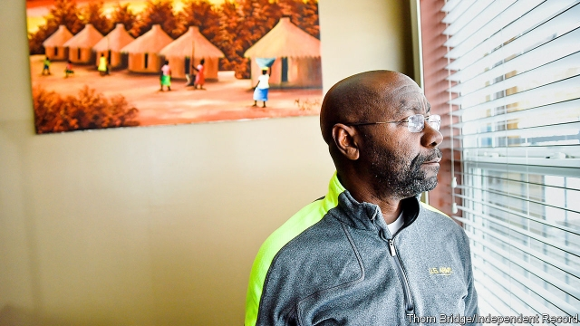
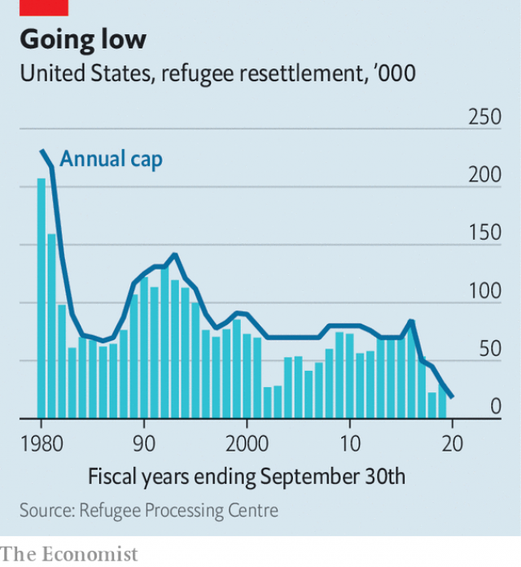

###### Denying opportunities costs

# What America could lose by curtailing refugee resettlement 

 

> print-edition iconPrint edition | United States | Dec 7th 2019 

AMERICA DID not settle a single refugee in October. In November it admitted under 1,500, the lowest total for that month since the aftermath of the 9/11 attacks. A new federal cap imposes a limit of 18,000 to be resettled next year, down from 85,000 in 2016. Canada now welcomes more refugees than its more populous neighbour. 

The decades-long period in which America resettled more refugees than the rest of the rich world combined has come to an end. The country long abided by an international convention that individuals who feared persecution because of their political opinions or their membership of particular social groups should get asylum. During the cold war, refugees were overwhelmingly perceived as democrats fleeing communist repression. 

 

Definitions have since expanded. That is partly due to changes in attitudes and domestic laws. In 1994 the first asylum-seeker won sanctuary on the basis of fearing persecution over sexual orientation. The Board of Immigration Appeals ruled in 2014 that Guatemalan women with repressive male companions could count as a group deserving refugee status. In 2016 it added a similar ruling to cover Salvadorean women who are abused. But the Trump administration is trying to curtail the broadening of who can count as a “persecuted group”. The recent dip in resettlement numbers mostly reflects the shrinking federal cap on them (see chart). A narrower definition of who may claim asylum would also keep numbers low. 

Stricter resettlement policies come with a cost. They run the risk of shutting out people like Wilmot Collins. As a young man ensnared in Liberia’s civil war in 1990, Mr Collins cheated death. Trapped in gun battles in Monrovia, the capital, he was twice almost killed by government soldiers. Seized by a rebel while he foraged for food, he narrowly avoided execution. Elsewhere, rebels beheaded his brother. Half-starved and sick with malaria, he fled with his wife aboard a cargo ship. 

Four years later—and only after lengthy vetting by UN and American officials while in Ghana—he reached Helena, Montana’s sleepy capital. He and his wife left, he recalls, with “nothing but the clothes on our backs”, arriving in an alien, snow-flecked place. They stand out. Barely 0.6% of Montanans are African-American. Explore Helena’s dainty streets, cafés or offices and almost only white faces appear. 

Montanans mostly offered the Collinses a generous welcome, but not all. Someone daubed “KKK” on a wall by their house; Mr Collins’s car was vandalised; a fake plane ticket came in the post, with a message saying “Go back to Africa”. He shrugged that off as the ranting of “crazy people”. Now when he hears politicians, including the president, saying similar things he says he feels “rotten”. He wants to show that people who are granted sanctuary in fact help to make America stronger. 

Public attitudes to refugees are sharply divided. Three-quarters of Democrats see a duty to take them in, according to a Pew poll last year; only one-quarter of Republicans agree (a drop from the previous year). Some Republicans worry about security, though rigorous vetting helps to ensure refugees are overwhelmingly law-abiding. In May the Cato Institute, a libertarian think-tank, estimated that an American has but a one in 3.86bn chance per year of being murdered by a refugee in a terrorist attack. The chance of being murdered by a native-born terrorist is about 1 in 28m. 

Others claim refugees are an economic drain. Yet where workers are scarce, they are likely to be a boon. Most refugees are employed within 180 days of arrival, points out David Miliband of the International Rescue Committee (IRC), which he says has resettled 350,000 in America. Mr Miliband is a former British foreign secretary. 

A few years back, after the mayor of Missoula, a city in western Montana, asked for more refugees, the IRC opened a resettlement office. Many refugees now work in supermarkets, hotels and other businesses in the city. Theo Smith, who owns Masala, a restaurant, says his workers from Congo, Iraq and Syria are loyal and capable. The (Republican) governor of nearby Utah, Gary Herbert, appears to agree. He wrote to Mr Trump in October asking for more refugees, whom he called valuable “contributors” to his state. 

Within days of Mr Collins’s arrival, a chance meeting with Montana’s governor led to his first job, at a children’s home. He has since been a caretaker and teacher. Six months after getting to Helena he also enrolled in the National Guard. Long spells in the navy and army reserves followed. 

Two years ago he turned to politics. In his speeches he has confronted misconceptions that refugees pay no tax, take others’ jobs or even get free cars. He jokes indignantly that somehow he missed out on such mythical goodies. (In fact, those given sanctuary must accept any job offered by a resettlement agency, such as the IRC, and repay some of the cost of getting to America, such as their plane tickets.) 

In 2017 Mr Collins made history when Helena’s voters picked him to run their city. He became the first black mayor ever elected in Montana. After moderate early success as mayor—a funding boost for local services, a plan for affordable homes—he is running for the Senate with a promise to make Washington more civil. Montanans, even rural folk in remote areas, have been nothing but supportive, he says. 

His chances of becoming the junior senator from Big Sky Country are slender. Three others are vying in the Democratic primary, which takes place in June. All would be overshadowed if Steve Bullock, Montana’s Democratic governor, were to run for the Senate. Whoever ends up taking on the Republican incumbent, Steve Daines, could struggle. Mr Daines raised a mountainous $1.2m in the latest quarter; Mr Collins lacks big donors. In the same period he gathered only $84,000. 

That, though, is not really the point. In few countries would Mr Collins’s story be possible. The candidate himself, a congenital optimist, expects America’s readiness to take in refugees to return. “On the whole, Americans have an open door,” he says, describing how he was met at the airport in Helena, in 1994, by a crowd of strangers who held a banner that read “Welcome home Wilmot”. But the America of 2019 is less welcoming than before. The refugee squeeze is just one sign of that.■ 

